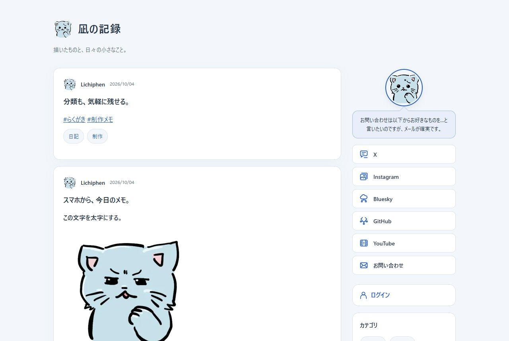
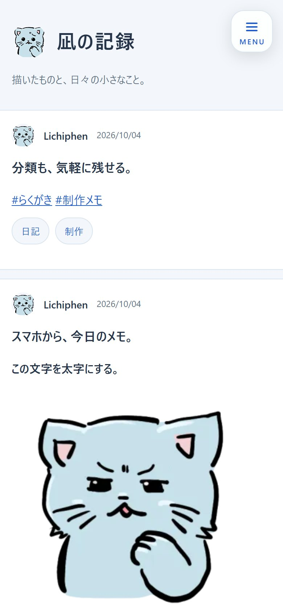
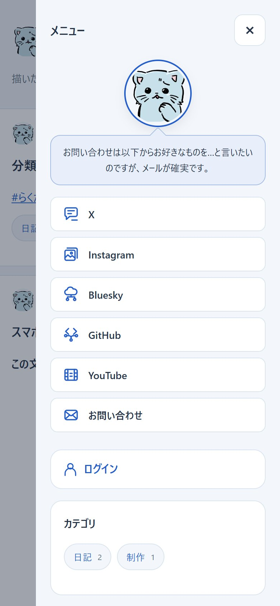
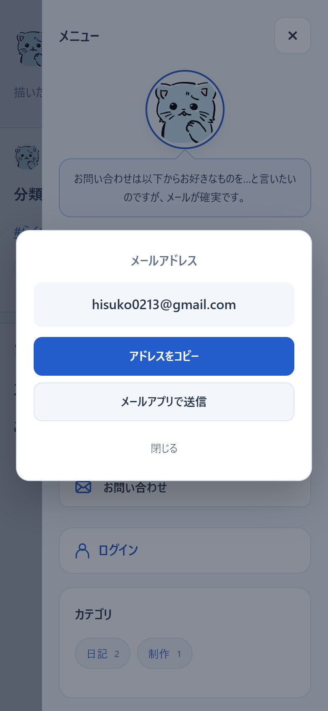
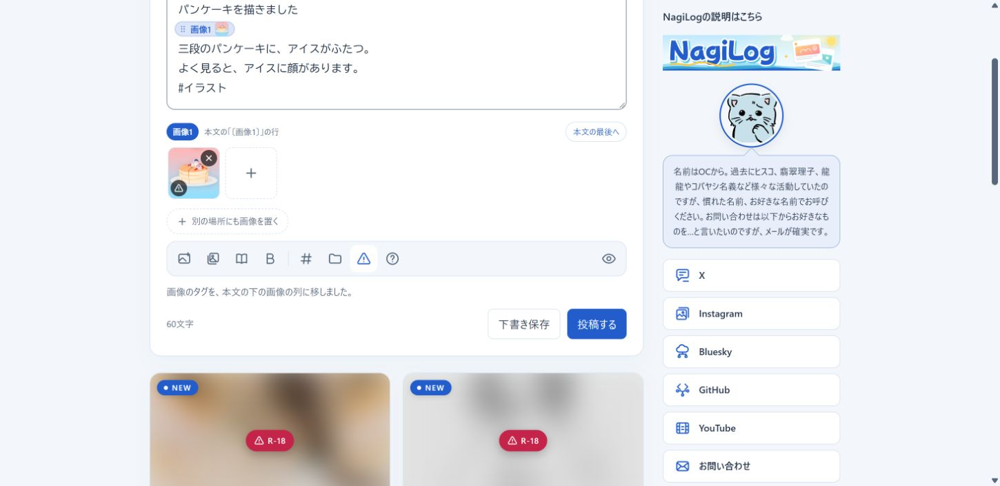
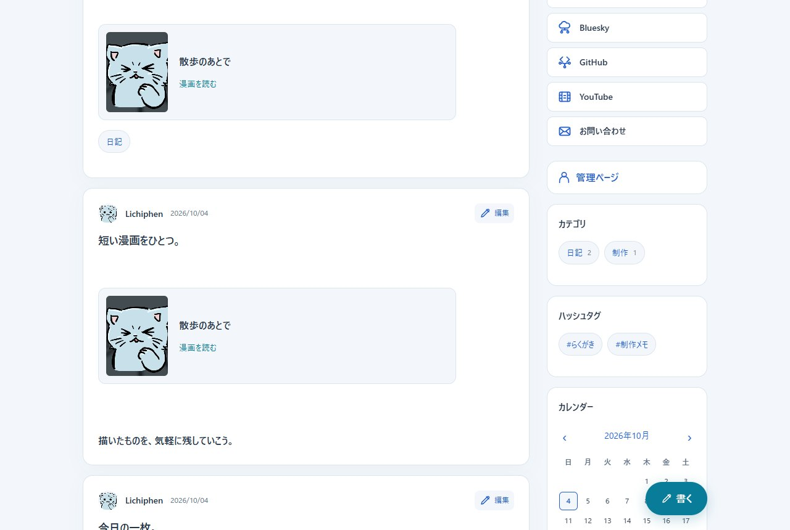
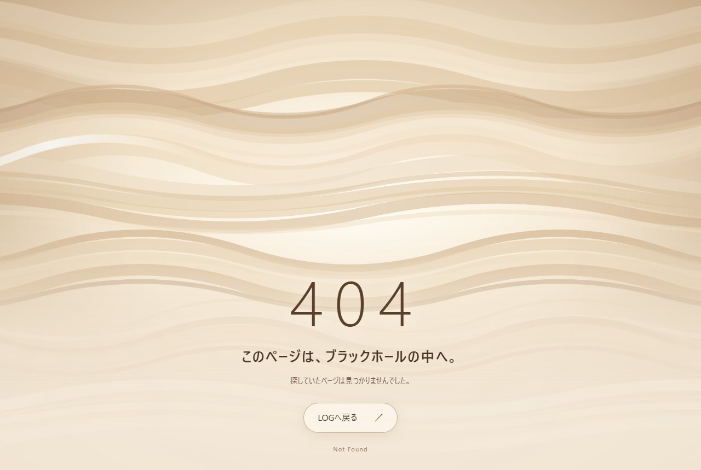
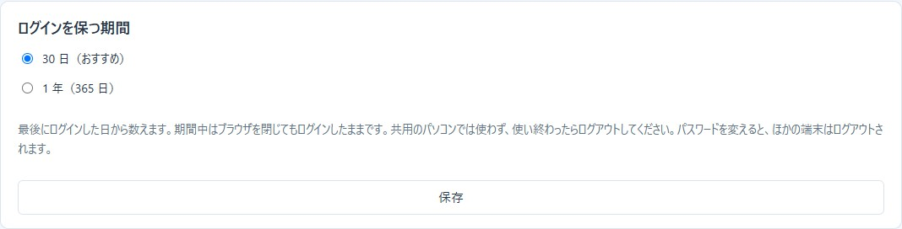

# NagiMangaの個人用LOG

文章、画像、漫画を、自分のサイトへ気軽に投稿できるLOGです。
データベースを使わず、NagiMangaの漫画管理とログインを共用します。
スマホの投稿画面は、NagiMemoの画面構成と操作の分け方を参考にしました。

このREADMEは、`feature/personal-log-cms` ブランチの開発版について説明しています。
版番号は0.4.0です。公開済みの配布版には、まだ反映していません。

<!-- TOC -->
## 目次

- [デモ](#デモ)
- [画面](#画面)
- [できること](#できること)
- [メリット](#メリット)
- [デメリットと向いている規模](#デメリットと向いている規模)
- [設置とログイン](#設置とログイン)
- [設定と公開範囲](#設定と公開範囲)
- [ローカルで続けて使う](#ローカルで続けて使う)
- [公開URL](#公開url)
- [投稿、画像、漫画](#投稿画像漫画)
- [SNSや動画の埋め込み](#snsや動画の埋め込み)
- [画像の形式・容量・管理](#画像の形式容量管理)
- [記事と専用画像を削除する](#記事と専用画像を削除する)
- [カテゴリとハッシュタグ](#カテゴリとハッシュタグ)
- [デザインとキャッシュ](#デザインとキャッシュ)
- [サイドバーの並び替えとHTML枠](#サイドバーの並び替えとhtml枠)
- [SEOとOGP](#seoとogp)
- [画像収集BOTへの対策](#画像収集botへの対策)
- [保存先を守る](#保存先を守る)
- [保存構造とバックアップ](#保存構造とバックアップ)
- [検証と残る確認](#検証と残る確認)
- [参照元と文章](#参照元と文章)
<!-- /TOC -->

## デモ

**https://notebook.lichiphen.com/nagimanga/**

作者が実際に使っているLOGです。公開側の表示、スマホのメニュー、メールのダイアログ、404を試せます。
投稿や設定の画面は、作者だけが使えます。ログインしたときの見え方は、下の「画面」で紹介します。
漫画ビューアーのデモ（[demo.html](https://notebook.lichiphen.com/nagimanga/demo.html)）と同じ設置です。1つの設置で、漫画の管理とLOGの両方が動きます。

## 画面

**パソコン**: 左に投稿、右にプロフィールとリンク集を並べます。記事の上には、投稿した日付を表示します。



**スマホ**: 投稿は横幅いっぱいです。右上の「MENU」から、パソコンと同じサイドバーを開きます。
メールのボタンを押すと、アドレスをコピーするか、いつものメールアプリで送るかを選べます。

<table>
<tr>
<td align="center"><br>トップ</td>
<td align="center"><br>MENU</td>
<td align="center"><br>メールのダイアログ</td>
</tr>
</table>

**ログイン中**: サイトの先頭に投稿欄が出ます。下へスクロールすると、サイドバーの右端にそろえた「書く」ボタンが出ます。

<table>
<tr>
<td></td>
<td></td>
</tr>
</table>

**404**: ブラックホールの中を描いています。ベージュの帯が波打ち、光の波が何度も打ち付けます。



## できること

| 機能 | 使い方・表示 |
| --- | --- |
| 投稿と下書き | ログインすると、サイトの先頭で書けます。投稿欄がスクロールで隠れると「ペン＋書く」が出ます。パソコンでは、サイドバーの右端にそろえて出します。ボタンは下からせり上がり、その上に「スパナ＋管理」のボタンが横から出ます。 |
| 太字とリンク | 選んだ文字を「B 太字」で強調できます。トリプルクリックで行ごと選んでも、改行は太字の外に残します。本文のURLはリンクになります。HTMLは文字として表示します。 |
| 埋め込みとカード | URLだけを1行に貼ると、YouTubeやXなどはドメインを見て自動で埋め込みます。ほかのページは、OGPを使ったブログカードで表示します。 |
| 画像 | 選択、ドロップ、貼り付けで追加できます。公開画像を押すとNagiSwipeで拡大・縮小できます。GIFアニメは動いたまま表示します。 |
| 漫画 | 新しい作品から、タイトルと表紙で選べます。本文に漫画カードを表示し、その場でビューアーを開けます。 |
| 編集と差し替え | 投稿を編集できます。「画像一覧・差し替え」で、画像の説明や画像そのものを変更できます。 |
| カテゴリ | 投稿時に作成・選択できます。LOG・投稿の「カテゴリ・タグ」で、名前と並び順を変更できます。 |
| ハッシュタグ | 本文の `#らくがき` などがリンクになります。投稿欄には、直近で使った8件を表示します。LOG・投稿から改名・並び替えできます。 |
| メール | リンク集にメールアドレスを登録できます。押した人は、コピーするか、既定のメールアプリで送るかを選べます。 |
| サイドメニュー | プロフィールとリンク集、カレンダー、最新の公開投稿3件、カテゴリ、ハッシュタグ、最終更新日を表示します。設定で並び替え・非表示にできます。 |
| HTML枠 | 上級者向けに、グリッドリンク・枠なしバナー・自由なHTMLのテンプレートから追加できます。 |
| スマホ表示 | 投稿は横幅いっぱいです。右上を追尾する、三本線と「MENU」の文字が入ったボタンからメニューを開けます。 |
| デザイン | ライト3種類、ダーク3種類から選べます。アイコンと共通のOGP画像も設定できます。 |
| 404 | 見つからないページに、ブラックホールの中を描いたアニメーションを表示します。端末の「動きを減らす」設定にも対応します。 |
| ログインの保持 | 最後にログインした日から30日間、ログインしたままです。設定で1年（365日）にもできます。 |
| 公開範囲 | 全体公開と、自分専用のMemoを選べます。Memoは記事とLOG画像をログイン時だけ表示します。 |
| 投稿一覧 | 本文を省いた短い行に、日時・タイトル・小さな画像・記事を見る・編集・削除を並べます。一括削除も使えます。 |
| フッター | 設定で表示を選び、サイト下部の文章を自由に変更できます。 |
| バックアップ | LOG用のZIPで、投稿、下書き、画像、分類、公開範囲、表示設定を保存・復元できます。 |

投稿のタイトルは、入力本文の1行目です。
本文は2行目以降を表示し、タイトル行を繰り返しません。
タイトルは通常の見出し文字で表示します。太字やURL・ハッシュタグのリンクは2行目以降の本文で使えます。
タイトル行のハッシュタグも、分類には含めます。
長いタイトルは投稿の見出しに全文を表示し、サイドメニューや共有情報では80文字で省略します。
1行目の画像・漫画タグは本文へ残すので、消えません。
画像だけの投稿は「画像の記録」と表示します。

## メリット

- データベースの準備や移行が不要です。投稿は1件ずつファイルで保存します。
- 公開LOGと、自分だけのMemoを同じ仕組みで選べます。
- 文章、絵、漫画を同じ投稿欄に置けます。画像や漫画のタグを移すだけで、表示位置も変えられます。
- 公開後に編集してもURLは変わりません。漫画の改題や画像の差し替えでも、本文との結び付きが残ります。
- NagiMangaの認証、画像変換、バックアップを使います。LOGのために別の管理者アカウントや外部サービスを増やす必要はありません。

## デメリットと向いている規模

個人が1人で使う、小さなサイト向けです。
複数の投稿者、コメント、いいね、フォロー、全文検索はありません。
大量の投稿や画像、アクセスが集中するサイトでは、ファイルの読み取りや保存時の待ち時間が増えます。
大量データでの負荷試験は、まだ行っていません。

本文は、太字、URL、ハッシュタグ、画像・漫画タグ、埋め込みを使う簡単な形式です。
投稿本文では自由なHTMLや、Wordのような編集機能は使えません。
サイドバーにはHTML枠を追加できますが、使える要素と属性を限定しています。
画像は読み直して保存するため、撮影情報などは残りません。GIFアニメはコマを保ったまま保存します。
SVGは使えません。元画像を保管したい場合は、別に残してください。

同じ画像タグを使う投稿は、画像を差し替えるとすべて変わります。
一部の投稿だけ変えたいときは、新しい画像として追加してください。
カテゴリやハッシュタグを削除する専用画面はありません。名前変更と、各投稿から外す操作に対応します。

記事の削除は取り消せません。その記事だけで使っていた画像も削除するため、
残しておきたい記事や画像は、先にLOGのバックアップを保存してください。

## 設置とログイン

必要なのは、PHP 8.1以上と、GD、fileinfo、mbstringです。
バックアップと復元、漫画EPUBの取り込みにはZipArchiveも使います。
サイドバーのHTML枠には、PHPのDOM拡張も必要です。
HTTPSで使い、保存先にPHPから書き込める権限を付けてください。

1. 確認用ZIPの `nagimanga/` をアップロードします。隠しファイルの `.htaccess` も送ってください。
2. 初回は `/nagimanga/admin/` を開き、30分以内に管理者パスワードを決めます。
3. 表示された管理用URLをブックマークします。
4. 設定の「共通・安全」にある「公開URL」に、`https://example.com/nagimanga` のように設置先を入力します。`log.php` は付けません。
5. 設定の「LOG」で、公開範囲、サイト名、紹介文、名前、デザイン、アイコンを選びます。
6. `data` が外から読めないことと、画像・漫画の表示を確認します。

製品の既定パスワードはありません。初回に自分で設定します。
管理者パスワードは10文字以上です。初回セットアップでは、現在のIPアドレスだけに管理画面を許可する設定がオンです。必要なら、あとから設定を変えられます。
公開LOGの「アイコン＋ログイン」からは、`admin/login.php` に入れます。
この入口のログイン条件も、パスワード、IP制限、試行回数の制限です。
同じIPアドレスから15分以内に5回ログインに失敗すると、一時的にログインできなくなります。

ログイン状態は、最後にログインした日から30日間続きます。ブラウザを閉じてもログインしたままです。
「設定 → 共通・安全」の「ログインを保つ期間」で、1年（365日）にもできます。



共用のパソコンでは、使い終わったらログアウトしてください。パスワードを変えると、ほかの端末はログアウトされます。
別のブラウザに同じCookieを持ち込んでも、ログインにはなりません。ブラウザの更新でバージョンが変わっても、ログインは続きます。
ゲスト（閲覧のみ）は、30分操作がないか、入ってから12時間で終わります。
スマホでIP制限を使うときは、自宅Wi-Fiと携帯回線の違いにも注意してください。

ソースから設置する場合は、`manga/server/` の中身に加えて、リポジトリの
`NagiSwipe-main.js` と `NagiSwipe-main.css` を設置先の `viewer/` にコピーします。
確認用ZIPには、この2ファイルを含めています。
既存環境を更新するときは、先にバックアップを取り、プログラムを上書きしてください。
自分の `data/` と `lib/paths.php` は上書きしません。

## 設定と公開範囲

設定は「NagiMANGA」「LOG」「共通・安全」のタブに分けています。
漫画の作品ページはNagiMANGA、LOGの公開範囲やデザインはLOGで設定します。
ログイン、保存先のURL、画像の上限、BOT対策は共通です。
タブを移動しても入力は残ります。保存は各ブロックのボタンから行います。
キーボードの左右キーでも、タブを移動できます。

LOGは既定で全体公開です。「自分専用のMemo」にすると、記事とLOG画像は管理者だけが読めます。
未ログイン、ゲスト、期限切れのセッションには、一覧・個別記事・分類ページ・画像を404で返します。
ログイン中のページと画像は`private, no-store`、公開ページは`Vary: Cookie`を指定します。
以前からログインしている場合は、管理画面を一度開き直すと、新しいCookieの範囲へ切り替わります。

Memoを全体公開へ切り替えると、保存済みの記事とLOG画像も公開されます。下書きは公開しません。
公開後に誰かが保存した画像や、外部サービスの既存キャッシュは回収できません。
NagiMANGAの作品は、LOGとは別の公開範囲です。作品のパスワードなどで管理してください。
Memoでも、保存先への直接アクセス拒否は必要です。後述の「保存先を守る」を確認してください。

サイトのメニューには、未ログインなら「ログイン」、管理者なら「管理ページ」と表示します。
「設定 → LOG → サイドバー・メニュー」で「ログイン・管理ページ」のスイッチをオフにすると、このブロックを隠せます。
入口を隠す場合は、管理URLを先にブックマークしてください。
スイッチをオフにしようとすると、管理用URLを表示した確認が開きます。「URLをコピー」「新しいタブで開く」でブックマークでき、「ブックマークした（隠す）」を選んだときだけオフになります。「まだ（表示したままにする）」やEscキーでは、オンのまま残ります。
ログインの入口とパスワードによる保護は、設定をオフにしても残ります。

| 一覧 | 既定の件数 | 変更する場所 |
| --- | --- | --- |
| サイトのトップ・日付・月・カテゴリ・タグ | 10件 | 設定の「LOG → 1ページの投稿数」。共通で1〜100件を指定できます。 |
| 管理画面の投稿一覧 | 20件 | 一覧上部の「1ページの表示件数」。1〜100件を指定できます。 |

管理画面の件数は、そのログインセッションの間だけ記憶します。
公開側の件数とは別なので、読者のページ送りには影響しません。
管理一覧はテーブルを使わず、短い行に日時・タイトル・サムネイル・記事を見る・編集・削除を並べます。
長いタイトルは一覧で省略します。編集画面では元の入力を確認できます。

## ローカルで続けて使う

作業中のLOGは、`http://127.0.0.1:5197/`で確認できます。
サーバーを終了したあとも、PowerShellでリポジトリのルートから次を実行すると、
同じ投稿・画像・設定を使って再開できます。

```powershell
powershell -NoProfile -ExecutionPolicy Bypass -File .\manga\dev\start_preview.ps1
```

どのフォルダーで開いたPowerShellからでも、ファイルの場所を絶対パスで書けば起動できます。
次の例は、リポジトリを`D:\000_tool\NagiSwipe`に置いた場合です。

```powershell
powershell -ExecutionPolicy Bypass -File D:\000_tool\NagiSwipe\manga\dev\start_preview.ps1 -Lan
```

Claude Codeの入力欄で実行するときは、先頭に`!`を付けます。自分で開いたPowerShellでは`!`を付けません。

保存先は`manga/dev/results/log-preview-data`です。2回目以降の起動では、データを作り直しません。
終了は`Ctrl+C`です。すでに5197番でサーバーが動いている場合は、その案内だけを表示します。
別のアプリが使っているときは`-Port 5199`のように番号を変えてください。

初めて起動するときは、リポジトリにあるサンプル（`manga/dev/sample/`の2つのZIP）から投稿・画像・漫画・設定を復元します。
サンプルの管理パスワードは`log-test-password`です。このPCで確認するためだけに使ってください。
ZIPはアプリのバックアップ機能で作るため、管理パスワードのハッシュ・秘密鍵・ログイン鍵は含みません。設置のたびに新しく作ります。
サンプルの作成にはPython 3が必要です。

| 追加の指定 | 動き |
| --- | --- |
| `-Lan` | 同じWi-Fiのスマホからも開けるようにし、スマホ用のURLを表示します。 |
| `-Reset` | サンプルからやり直します。今までの保存先は日時付きの名前で残します。 |
| `-Empty` | サンプルを使わず、空のLOGで始めます。管理URLからパスワードを決めます。 |

今のプレビューの内容を新しいサンプルにするときは、プレビューを起動したまま`python manga/dev/sample_data.py export`を実行します。

`demo-site`の予行演習は、見本漫画用の一時データを毎回作り直す別の道具です。
このLOGを続けて使う場合は、上の起動方法を使ってください。

## 公開URL

| ページ | URLの例 |
| --- | --- |
| トップ | `https://example.com/nagimanga/` |
| 個別投稿 | `https://example.com/nagimanga/?id=20261004123033` |
| カテゴリ | `https://example.com/nagimanga/?category=abcdef123456` |
| ハッシュタグ | `https://example.com/nagimanga/?tag=らくがき` |
| 日付・月 | `?date=2026-10-04` / `?month=2026-10` |

記事の上には、個別投稿へのリンクとして日付（例：`2026/10/04`）だけを表示します。時刻は、マウスを重ねると出ます。
投稿番号は、初めて公開した日本時間の年・月・日・時・分・秒です。
同じ秒に重なると `20261004123033-02` のように連番を付けます。
下書きには仮番号を使い、初回公開時に日時の番号へ変えます。
公開後に下書きへ戻した投稿は、再公開しても同じURLです。

以前の `log.php` と `log.php?id=…` は、対応する新URLへ301転送します。
サーバーでは `index.php` をディレクトリの入口にしてください。
PHPのファイル名をURLから外すだけで、安全性が高まるわけではありません。
認証、保存先の保護、入力の検証は別に必要です。

「公開URL」を空欄にすると、アクセス時のHostから共有URLを作ります。
公開前に正しいURLを設定し、canonicalとOGPが自分のドメインになることを確認してください。

## 投稿、画像、漫画

管理者としてログインすると、サイトの先頭に投稿欄と、各記事の編集ボタンが出ます。
投稿欄が画面の上へ隠れると「ペン＋書く」が表示され、投稿画面を開けます。
管理一覧では「新しく書く」から開きます。Memoの保存ボタンは「メモを保存」です。

本文を入れ、「投稿する」か「下書き保存」を選びます。本文の上限は100,000バイトです。
未保存の入力は、このタブの保存領域にも残します。
別の端末への同期や正式なバックアップにはならないので、書き終えたら保存してください。
別タブで先に編集された場合は、その上へ保存せず、開き直すよう案内します。

画像のタグは `[Image:画像番号]`、漫画のタグは `[Mangaタイトル名]` です。
タグを切り取って貼り直すと、本文中の位置を変えられます。
同名の漫画は、タグに識別番号を添えて区別します。
漫画の改題後も作品IDで結び付けるため、以前の投稿から読めます。

パスワード付き漫画は、公開カードに表紙を出さず、読むときにパスワードを確認します。
個別ページを非公開にした漫画も、カードの表紙には共通画像を使います。
未ログインでは、LOGの下書きと、それだけに使っている画像は404になります。
全体公開のLOGでは、アイコンと共通OGPの画像も公開します。
自分専用Memoでは、この画像も管理者としてログインしたときだけ読めます。
画像一覧からの削除では、投稿、下書き、アイコン、共通OGP、サイドバーで使っている画像を保護します。

## SNSや動画の埋め込み

URLだけを1行に貼ると、ドメインを見て自動で埋め込みます。特別な書き方はいりません。
文の途中に書いたURLは、埋め込まずに普通のリンクにします。紹介したいときは単独の行に、話の中で触れるだけなら文中に書いて使い分けます。

| 埋め込むもの | 貼るURLの例 |
| --- | --- |
| YouTube（動画・ショート・ライブ・再生リスト、`t=`の開始位置） | `https://youtu.be/動画ID`、`https://www.youtube.com/watch?v=…` |
| ニコニコ動画 | `https://www.nicovideo.jp/watch/sm9`、`https://nico.ms/sm9` |
| Spotify（曲・アルバム・プレイリスト・アーティスト・ポッドキャスト） | `https://open.spotify.com/track/…` |
| Apple Music（曲・アルバム・プレイリスト） | `https://music.apple.com/jp/album/…` |
| X（Twitter）のポスト | `https://x.com/ユーザー名/status/番号` |
| Instagramの投稿・リール | `https://www.instagram.com/p/…`、`/reel/…` |
| CodePen | `https://codepen.io/ユーザー名/pen/…` |
| note、Voicy、Steam | 記事・チャンネル・ストアのページのURL |
| マンガ（少年ジャンプ＋などGigaViewerの19サイト） | `https://shonenjumpplus.com/episode/番号` |
| 動画ファイル（mp4・webm・ogv・mov・m4v） | `https://example.com/movie.mp4` |

1行目が埋め込みのURLだけの投稿は、「YouTubeの記録」のようなタイトルになります。説明文では「（YouTube）」と表示します。
配色がダークのときは、Xの埋め込みもダーク表示にします。プレビューでも埋め込みを確認できます。

埋め込みの枠は、URLから読み取ったIDを使って、このプログラムが組み立てます。
本文に`<script>`を書き出すことはありません。X、Instagram、noteの公式スクリプトは、その埋め込みがあるページだけで`viewer/log-embed.js`が読み込みます。
セキュリティ設定（CSP）で、埋め込みの枠は上の各サービスだけ、外部のスクリプトはX・Instagram・noteだけに限っています。
YouTubeは、Cookieを使わない`youtube-nocookie.com`で埋め込みます。

埋め込みを表示すると、訪問者のブラウザが各サービスへ接続します。IPアドレスなどがそのサービスに伝わり、サービス側のCookieが使われる場合もあります。
削除された投稿や非公開の投稿は、各サービスの表示に従います。必要に応じて、サイトのプライバシーポリシーに書いておいてください。

### ブログカード

埋め込みに対応していないURLを1行に貼ると、そのページのOGP（タイトル・説明・サイト名・画像）を使ったカードで表示します。
OGPがないページは、`<title>`と説明文を使います。取得できないページは、普通のリンクのままです。

ページを読みに行くのは、管理者が投稿を保存したときと、プレビューを開いたときだけです。訪問者がページを見るたびに外部へ取りに行くことはありません。
取得した内容は`data/log/cards/`に保存し、1週間たってから保存し直したときに取り直します。読めなかったページは、翌日以降の保存で再び試します。
カードの画像は、このサーバーに取り込んで縮小し、読み直して保存します。訪問者のブラウザは外部サイトへ接続せず、画像の中に隠したデータも残りません。

外部のページを読み込むため、次の制限を設けています。

- 読みに行けるのは`http`と`https`の80番・443番ポートだけです。URLにユーザー名やパスワードを含むものは読みません。
- 名前解決した先が、ループバック、社内向けの範囲、リンクローカル（クラウドのメタデータを含む）、CGNAT、予約済みの範囲なら読みません。確かめたアドレスにだけ接続し、名前解決のすり替えも防ぎます。
- 転送は3回まで、転送先も同じように確かめます。ページは1MB、画像は8MBまで、1回の保存で10件・合計20秒までです。
- 文字コードはShift_JISやEUC-JPにも対応します。カードの文字はHTMLとして解釈せず、エスケープして表示します。

LOGのバックアップには、カードの保存内容は含めません。引っ越し先では、その投稿を保存し直すとカードを作り直します。

## 画像の形式・容量・管理

画像はJPEG、PNG、GIFに加えて、WebP、AVIF、BMPを受け付けます。WebP・AVIF・BMPの取り込みには、サーバーのGDが各形式の読み込みに対応している必要があります。取り込んだ画像はサーバーで読み直して保存し、WebPを書き出せる環境ではWebP、それ以外ではJPEGに変換します。

2コマ以上のGIFアニメは、GIFのまま保存します。本文の小さな表示も、NagiSwipeでの拡大表示も動きます。
GDはアニメーションを書き出せないため、GIFの中身を区切りごとに読み、絵を描く部分だけで組み直します。
コマの画像、表示時間、繰り返しの指定は残し、コメント、独自のデータ、終わりの印より後ろのデータは捨てます。
画像に紛れ込ませたPHPやHTMLは、この組み直しで残りません。配信も`image/gif`と`nosniff`の指定で行います。
コマは3,000枚まで、コマ数×縦×横は15億画素までです。1コマだけのGIFや、形の崩れたGIFは、これまでどおりWebPかJPEGに変換します。

画像の上限は「共通・安全 → 設置先と画像アップロード」で1〜200MBに設定できます。初期値は30MBです。PHPの`upload_max_filesize`もアップロードできる容量に影響します。画像は一辺16,000px、総画素数5,000万までです。画像処理に必要なメモリが足りない場合も取り込めません。

画像の画質も共通設定で調整でき、60〜100の範囲で指定します。初期値は90です。

「画像一覧・差し替え」は1ページ40件です。各画像の説明を300文字まで編集でき、使用件数と、アイコン・共通OGP・サイドバーでの使用状況を確認できます。「画像を差し替える」から選ぶほか、差し替えたい画像の枠へ新しい画像をドラッグ＆ドロップしても差し替えられます。画像を差し替えると、同じ画像タグを使う投稿や設定すべてに反映されます。削除できるのは未使用の画像だけです。投稿、下書き、アイコン、共通OGP、サイドバーで使っている画像は削除できません。

## 記事と専用画像を削除する

投稿一覧の「削除」で、1件の記事を削除します。
「まとめて削除」を開くと、記事を選んで一度に削除できます。
選んでいる間は、ボタンが濃い色の「× 選ぶのをやめる」に変わり、削除のバーは赤みのある色で表示します。
「このページをすべて選ぶ」は、今のページにある記事だけが対象です。
確認画面に選択件数を表示し、実行前に削除を確かめます。
最初はキャンセルボタンに選択を置きます。Escキーでも取り消せます。

選んだ記事の原本と、その記事だけで使っていた画像・縮小画像・画像情報・保存受付記録を削除します。
ほかの記事や下書き、アイコン、共通OGP、サイドバーでも使う画像は残します。
本文の原本から共有を確認するため、一覧用ファイルが古くても共有画像を保護します。
無関係な未使用画像、漫画の原本、カテゴリ設定、セキュリティログは消しません。

選んだ全記事の更新番号を確認してから削除します。
別の画面で更新された記事が含まれていれば、全体を中止します。
途中の移動や一覧更新に失敗した場合は、移した記事と画像を戻します。
正常に終わると一時フォルダを消し、空になった年・下書きフォルダも整理します。
保存先の権限不足や処理の強制終了では、掃除や復旧が完了しない場合があります。

削除した記事の古い編集欄からは保存できません。
新規投稿欄の再送防止記録も整理するため、古い新規投稿欄を再送すると新しい記事になる場合があります。
同じ秒のうちに削除・再投稿した場合は、削除した投稿番号を再び使う場合があります。
削除後は古い投稿欄を閉じ、画面を開き直してください。

## カテゴリとハッシュタグ

カテゴリの選択・新規作成は、投稿欄の「カテゴリを選ぶ・作る」から行えます。
新規作成では「日記、制作メモ」のように「、」で区切れます。
カテゴリ名は40文字まで、1投稿に20個までです。

本文の `#らくがき` や `#制作メモ` は、同じタグの投稿を読むリンクになります。
タグ名には、文字、数字、アンダースコアを使えます。長さは60文字までで、区切りは空白や句読点です。
URL内の `#`、画像タグ、漫画タグは、ハッシュタグとして数えません。
投稿欄の最近使ったタグを押すと、本文に挿入できます。

「LOG・投稿 → カテゴリ・タグ」で名前を変更できます。
持ち手をドラッグするか、上下ボタンで並び順を変えられます。
マウスとタッチに対応し、並び替えた順番はその場で保存します。
カテゴリはサイトのメニューと投稿欄へ、ハッシュタグはサイトのメニューへ反映します。
サイドバーでは、カテゴリをフォルダのアイコンと件数付きの一覧に、ハッシュタグを「#」付きの文字の並びにして、見分けやすくしています。
投稿欄の直近8件のハッシュタグは、手動の順番に変えず、使用履歴から表示します。
別の画面でも分類を変えていた場合は保存せず、画面を開き直すよう案内します。
カテゴリの改名後も、URLの番号は同じです。
ハッシュタグの改名は、公開済みの本文と下書きにも反映します。
改名前のハッシュタグURLからは、自動転送しません。

## デザインとキャッシュ

ライトブルーが標準です。ほかにライトセージ、ライトペーパー、
ダークネイビー、ダークチャコール、ダークプラムを選べます。
色見本を押すとラジオボタンも選ばれ、その画面で見比べられます。
公開サイトへの反映は保存後です。スマホではラジオボタンを色見本の下に置きます。

「LOG → サイト下部の表記」で、フッターの表示・非表示と文章を変更できます。
標準は「Powered by NagiLog＆NagiManga」です。以前の標準「Powered by NagiManga / NagiSwipe」のまま保存していたサイトも、新しい標準の表示に変わります。200文字までの1行で入力でき、HTMLは文字として扱います。
空欄でもフッターを隠します。各ソースのライセンス表記はそのまま残ります。

404は、ブラックホールの中をSVGとCSSで描きます。中の様子には諸説ありますが、何十ものベージュが波打つ美しい空間という説を形にしました。
6つの束に分けた36本の帯が、それぞれ違う速さと向きで流れます。数秒ごとに光の波が左から何度も打ち付け、帯は上から順に大きく波打ってから静まります。
ぼかしの効果は使わず、帯の移動と伸び縮みだけで動かすため、ちらつきが出にくい作りです。
外部画像やJavaScriptを読み込まず、端末の「動きを減らす」設定ではアニメーションを止めます。
ページの内容を示さない通常の404応答と、検索から除外する指定は共通です。

スクロールバーは、各配色に合わせた丸い形です。見た目はブラウザによって異なります。
JSとCSSのキャッシュバスターは、内容の変更に応じて変わる更新番号です。
漫画CSSだけの変更も、読み込み用JSの更新番号へ反映します。
差し替えた画像のURLにも新しい版番号を付けます。
共有先サービスのOGPキャッシュを強制的に消す機能はありません。

### LiteSpeed Cache

LiteSpeedのサーバーでは、公開LOGのページをサーバー自体がキャッシュし、PHPを動かさずに返します。
LiteSpeedかどうかは自動で判断します。LiteSpeedでないサーバーでは何も送らず、これまでどおりに動きます。
設定の「共通・安全 → LiteSpeed Cache」で、使っているかどうかを確認できます。LiteSpeedのサーバーでは、ここからオフにもできます。

| ページ | キャッシュ |
| --- | --- |
| ログインしていない人が見る公開LOG（トップ・記事・分類・日付） | する（1時間） |
| 管理画面、ログイン中の表示、ゲスト | しない |
| 自分専用のMemo、404 | しない |
| 投稿画像・カード画像 | しない（画像収集BOTへの対策をPHPで続けるため） |

ログインCookieを持つ人は、キャッシュとは別に扱います。キャッシュした訪問者用のページが、管理者に表示されることはありません。
管理画面で投稿・画像・漫画・設定を変えたり、復元したりすると、LOGのキャッシュをすぐに消します。
カレンダーの「今日」を正しく保つため、キャッシュは1時間で作り直します。
同梱の`.htaccess`に、LiteSpeedのときだけ働く`CacheLookup on`を入れています。サーバー側でキャッシュ機能が無効の場合は、この設定も働きません。

## サイドバーの並び替えとHTML枠

サイドバーの先頭には、枠なしのプロフィール・リンク集を表示します。
LOG設定で選んだアイコンを中央に置き、その下に横長のリンクボタンを並べます。
アイコンを設定していない場合は、表示名の先頭の文字を使います。
アイコンには、既定でテーマの色のフチを付けます。「アイコンにフチを付ける」をオフにすると外せます。
リンクの上には、サイトの紹介文とは別のメッセージを300文字まで表示できます。改行は使えますが、HTMLは使えません。空欄なら表示しません。
メッセージは、アイコンへ向かって下から話しかける吹き出しの形です。

「プロフィールとリンクを編集」で、フチ・メッセージと、各リンクの表示名・URL・用途を表すアイコンを編集できます。
リンクの追加・削除・上下の移動もできます。
初期のURLはX、Instagram、Bluesky、GitHub、YouTubeのトップページです。
たとえば、XのURLを自分のプロフィールURLに書き換えて使います。

SVGは、会話・写真・空と通信・コードの分岐・フィルム・封筒（メール）・一般リンクを描いたオリジナルです。
メールは、「URL・メール」欄に`you@example.com`のようにアドレスだけを書き、「メール」のアイコンを選びます。`mailto:`付きでも入力できます。
訪問者がメールのボタンを押すと、アドレスを表示したダイアログが開きます。「アドレスをコピー」か「メールアプリで送信」（いつも使っている既定のメールアプリ）を選べます。
JavaScriptが動かない環境では、そのまま既定のメールアプリを開きます。件名付き（`?subject=`）や複数の宛先は使えません。
公式ロゴや既存のブランド画像は使っていません。
`server/viewer/link-icons/`にSVGとMITライセンスの全文を同梱しています。
既存のサイドバー設定や旧バックアップにも、リンク集を追加します。
ほかの項目の順番は保ちます。リンク集を隠す場合は、表示のスイッチをオフにして保存します。

「設定 → LOG → サイドバー・メニュー」で編集します。
各項目は1行にまとまっており、持ち手をドラッグするか、上下ボタンで移動できます。
スイッチをオフにすると非表示になります。スマホの「MENU」にも同じ順番を使います。
順番と内容は、画面下に固定した「サイドバーを保存」でまとめて反映します。
ログインリンクの表示も、この「ログイン・管理ページ」のスイッチだけで切り替えます。以前の「公開範囲・表示件数」にあった設定は、ここへ移しました。

「上級者向け：HTML枠を追加」を開き、テンプレートを選んで追加します。
枠の個数は決めていません。同じテンプレートを繰り返し呼び出せます。
グリッドリンクは2列のリンク集、バナーリンクは枠と背景を付けない画像リンクです。
追加後に、リンク先・画像のURL・文章を自分の内容へ書き換えてください。
見出しを空欄にすると見出しを隠せます。「枠と背景を表示する」も変更できます。

HTML枠では、リンク、画像、見出し、段落、リスト、太字を使えます。
script、iframe、フォーム、イベント属性、style属性は、保存時に取り除きます。
レイアウト用のclassは`log-link-grid`、`log-banner-link`、`log-banner`を使えます。
見出しは100文字、1枠のHTMLは安全化した後も50KB、全体は1MBまでです。
別の画面で先に保存した場合は上書きせず、変更内容を編集欄へ残して開き直すよう案内します。
画面を開き直す前に、未保存のHTMLは別にコピーしてください。

画像のURLは、同じサイトへの相対URLか、HTTPSのURLを指定します。
外部画像は表示時に外部サーバーへ取得しに行くため、訪問者のIPなどがそのサーバーへ伝わります。
同じサイトに置いた画像なら、この外部通信を避けられます。
HTML枠から参照するLOG画像は、元の記事を削除しても残します。
全体公開のLOGでは、表示中のHTML枠から参照するLOG画像も公開します。
非表示の枠が使う画像は削除から保護しますが、その枠だけを理由に公開はしません。
自分専用Memoでは、サイドバーとそのLOG画像もログイン時だけ表示します。

HTML枠を外して保存しても、リンク先や画像そのものは削除しません。
使わなくなったLOG画像は、「画像一覧・差し替え」から削除できます。

## SEOとOGP

| ページ | 検索エンジンへの指定 |
| --- | --- |
| 全体公開で、投稿があるトップ・カテゴリの1ページ目 | `index,follow` |
| 個別投稿・ハッシュタグ・日付・月・2ページ目以降 | `noindex,follow` |
| 投稿がない一覧 | `noindex,follow` |
| 自分専用Memoの全ページ | `noindex,follow`。未ログインには404 |
| 404 | `noindex,nofollow` |

このLOGは、トップとカテゴリを検索の入口にする方針です。
個別投稿をnoindexにすると、その投稿自体からの検索流入は受けられません。
重複をまとめるだけならcanonicalも使えるため、個別投稿のnoindexは必須ではありません。
今回は、依頼された公開方針として採用しています。
詳しくはGoogleの [noindexの説明](https://developers.google.com/search/docs/crawling-indexing/block-indexing?hl=ja) と
[正規URLの説明](https://developers.google.com/search/docs/crawling-indexing/consolidate-duplicate-urls?hl=ja) を参照してください。
公開ページをrobots.txtで一括拒否すると、検索エンジンがnoindexを読めなくなります。

OGPは、URLをSNSなどで共有したときに出る紹介カードの情報です。
個別投稿では、本文の先頭から見て最初の画像を使います。
画像タグを並べ替えると、選ばれる画像も変わります。
画像がない投稿のOGPは、設定した共通OGP画像です。未設定なら同梱の共通画像を使います。
漫画だけの投稿も、この共通画像を使います。
全体公開のLOGは、検索から除外する投稿にも共有カードを残します。
自分専用Memoでは、外部サービスに本文やLOG画像を渡さないため、OGPカードは利用できません。

## 画像収集BOTへの対策

設定の「共通・安全 → 画像収集BOTへの対策」で、収集ツール名と取得回数の上限を調整できます。
既定では、画像収集ツールを示すUser-Agentと、同じIPからの大量取得を404で拒否します。
LOG画像と漫画画像に共通で適用します。文章の閲覧やAIを一律に拒否する設定ではありません。

既定の上限は、10秒区間に120件、1分区間に300件です。
上限を超えたIPからの画像取得は5分間拒否します。
同じ回線を使う人や、画像の多い漫画の閲覧も回数に含まれます。
正当な閲覧に影響があるときは、上限や収集ツール名を調整してください。

User-Agentを普通のブラウザに偽装し、少量ずつ取るBOTや、IPを分散するBOTは完全には見分けられません。
公開された画像の保存をすべて防ぐ仕組みでもありません。
大規模な取得への対策は、必要に応じてサーバーやCDN側にも設けてください。

## 保存先を守る

保存先はNagiMangaと共通の `data/` です。
公開フォルダの外へ移す方法を推奨します。たとえば、サーバー上の
`/home/you/nagimanga-data` に保存先を移し、`lib/paths.php` を次の内容で作ります。

```php
<?php return '/home/you/nagimanga-data';
```

PHPから書き込めることを確認してください。
公開フォルダ内へ置く場合は、`.htaccess` などで `data/` へのHTTPアクセスを拒否します。
nginxなどで `.htaccess` が使えない場合は、保存先を外へ移すか、サーバー設定で拒否してください。

LOGの内部記録は直接開くと404になるPHP形式ですが、画像ファイルにはPHPの処理がありません。
HTTPで保存先へ入れる状態では、画像の実パスが判明すると認証やBOT対策を迂回できます。
秘密鍵から作った保存フォルダ名は、暗号化の代わりにはなりません。
管理画面の警告と、外部からの直接アクセス拒否を、公開前に確認してください。
サーバー設定の詳しい例は [NagiMangaの設置説明](README.md#data-フォルダを守る) にあります。

## 保存構造とバックアップ

| 保存物 | `data/` 内の場所 |
| --- | --- |
| 公開済み投稿の原本 | `log/posts/年/投稿番号.php` |
| 初回公開前の下書き | `log/posts/drafts/仮番号.php` |
| 一覧用の派生情報 | `log/index.php` |
| カテゴリ | `log/taxonomy.php` |
| LOGの表示設定 | `log/settings.php` |
| サイドバーの順番・表示・リンク集・HTML枠 | `log/sidebar.php` |
| 画像と画像情報 | `log/media/秘密鍵から作るフォルダ/` |

一覧用ファイルの内容は、原本から読み直せる派生情報です。
FTPで原本を編集した場合は、`log/index.php` を取り除くと一覧へ反映できます。
通常の投稿・編集では、一覧用ファイルも更新します。

バックアップ画面で、漫画用ZIPとLOG用ZIPをそれぞれ保存します。
LOG用ZIPには、本文、下書き、画像、カテゴリ、デザイン、アイコン、OGP設定を含めます。
公開範囲、ログインリンクの表示、公開側の表示件数、フッター、分類の並び順も保存します。
サイドバーの順番、リンク集、HTML枠も含めます。外部リンク先の画像ファイルは取り込みません。
上書き復元では、そのZIPに保存された公開範囲も反映します。
公開範囲を持たない旧形式のZIPでは、復元先の公開範囲を維持します。
サイドバーを含まない旧形式のZIPでは、復元先のサイドバーを維持します。
ハッシュタグは本文から読み直します。
管理者のパスワード、秘密鍵、IP制限、BOT対策の設定は含めません。
これらの設定は引っ越し先で確認してください。

漫画を含むLOGの引っ越しでは、先に漫画用ZIP、次にLOG用ZIPを復元します。
LOG用ZIPだけでは、漫画のページ画像は移りません。
同じIDがある投稿・画像は通常は上書きせず、上書き指定時だけ差し替えます。
復元前にも、引っ越し先のバックアップを取ってください。

## 検証と残る確認

2026年10月4日に、別Agentが専用コピーで機能監査と敵対検証を行いました。
機能監査は、データを作り直して繰り返しています。

| 検証 | 結果 |
| --- | --- |
| LOGのHTTP・保存・復元など | 153項目を2回通過 |
| 既存の漫画CMS | 186項目を2回通過 |
| 管理者表示・Memo・表示件数の独立試験 | 93項目を2回通過 |
| フッター・分類順序・記事削除 | 104項目を2回通過 |
| ローカル起動・再起動 | 6項目を2回通過 |
| 削除途中の保存故障 | 4項目を2回通過 |
| サイドバー・HTML枠・共有画像・プロフィール | 120項目通過 |
| 削除・並び順の敵対検証 | 68項目通過。JSON・更新番号の境界50項目も通過 |
| HTML枠の敵対検証 | HTML・URL・ZIP・画像保護など153項目通過 |
| ブラウザ | 390×844とパソコン幅で投稿・プレビュー・保存・浮遊ボタン・設定タブ・Memo・投稿一覧を確認。サイドバーは390×844でドラッグ・上下移動・HTML追加・保存・公開表示を確認 |

同じ日の夜に加えた変更のあと、次を再確認しました。変更は、メールのダイアログ、404、吹き出し、日付表示、「書く」ボタンの位置、ログインの保持です。

| 検証 | 結果 |
| --- | --- |
| LOGのHTTP・保存・復元など | 154項目通過 |
| 漫画CMSとセキュリティ（ログインの保持を含む） | 192項目通過 |
| サイドバー・メールのリンク | 127項目通過 |
| フッター・分類順序・記事削除 | 104項目通過 |
| ブラウザ | パソコン幅と390×844で、メールのダイアログ（コピー・送信・Esc）、404の動き、横はみ出しがないことを確認 |

続けて追加した、SNSや動画の埋め込み、ブログカード、GIFアニメの保存は、次で確認しました。

| 検証 | 結果 |
| --- | --- |
| 埋め込み・カード・GIFアニメ（新しい試験） | 58項目通過。17パターンの自動埋め込み、文中のURLはリンクのままにすること、似たドメインの拒否、CSP、プレビュー、OGPカード（転送・Shift_JIS・分割転送・エスケープ・内部アドレスの拒否・訪問者の表示で取りに行かないこと）、GIFの組み直し・差し替え・復元を含む |
| LiteSpeed Cache（新しい試験） | 18項目通過。LiteSpeedとして動かしたサーバーで、キャッシュする・しないの区別、ログインCookieでの分離、変更時の削除、オン・オフを確認。LiteSpeedでないサーバーには何も送らないことも確認 |
| 既存の試験 | LOG 154項目、セキュリティ192項目、サイドバー127項目、削除など104項目を再び通過 |
| ブラウザ | パソコン幅と390×844で、YouTube・X・Spotify・Steam・マンガの表示、GitHubとphp.netのブログカード、横はみ出しがないこと、トリプルクリックで選んだ行の太字を確認 |

機能側は合計634項目を各2回確認しました。
最後の画像URL判定の修正後は、サイドバー88項目と削除104項目を再確認しています。
ほかの変更がない部分は、その直前の回帰試験を維持しています。

監査で見つかった、数字だけのカテゴリIDの表示・復元の不具合と、
同じ秒の100件目以降の並び順の不具合を修正しました。
タイトル行を本文で繰り返す表示も修正し、回帰試験に追加しています。
今回の監査では、10件表示に合わせて原本復旧の試験を全ページ確認へ変え、
認証済み画像のキャッシュ指定を本文とそろえました。
削除では、数字だけの画像ID、空のフォルダ、JSONの型を追加で確認しました。
HTML枠では、安全化後の長さと、画像URLの表記違いによる削除保護の漏れを修正しています。
詳しい結果は [監査記録](docs/personal-log-audit.md) にまとめています。

実際のiPhone・Android、公開サーバーのApache・nginx設定、共有先のOGP取得は未確認です。
公開前に、設置先でログイン、アップロード、バックアップ、画像の直接アクセス拒否を確認してください。

再実行する場合は、リポジトリのルートで次を実行します。
テストは専用コピーを作り、通常の保存データを変更しません。

```text
python manga/dev/log_test.py
python manga/dev/attack_test.py
python manga/dev/log_management_test.py
python manga/dev/log_sidebar_test.py
python manga/dev/log_embed_test.py
python manga/dev/log_lscache_test.py
python manga/dev/preview_test.py
python manga/dev/build_release.py
```

## 参照元と文章

画面構成の参照元は [NagiMemo](https://github.com/Lichiphen/NagiMemo) の
コミット `e2fc9df1af817e9ca2fd09f1c444698c1b90edf9` です。
投稿欄、スマホのパネル、画像追加の分け方を参考にしています。
てがろぐ用の保存処理は移植せず、NagiMangaの保存と認証を使いました。
NagiMemoとNagiSwipeは、ともにLichiphenのMITライセンスです。

このREADMEはsoft-japanese-writingに沿って作成し、yomiyasuで推敲・検査しています。
実装の判断と追加した仕様は [作業記録](docs/personal-log-plan.md) に残しています。
