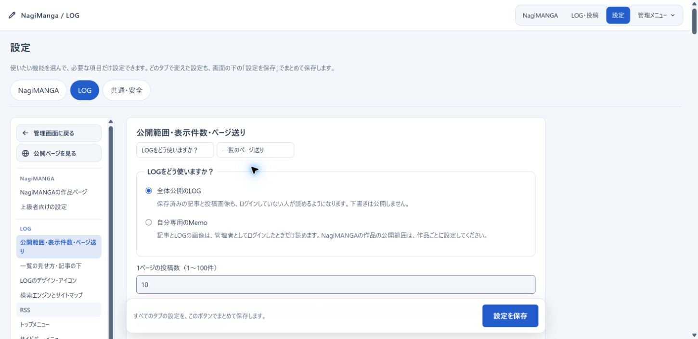
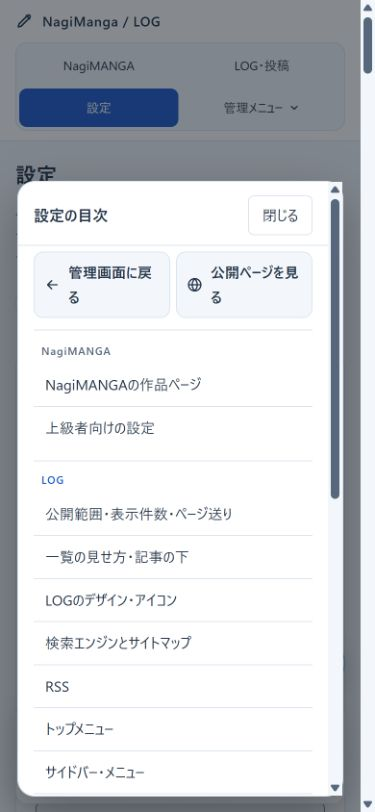
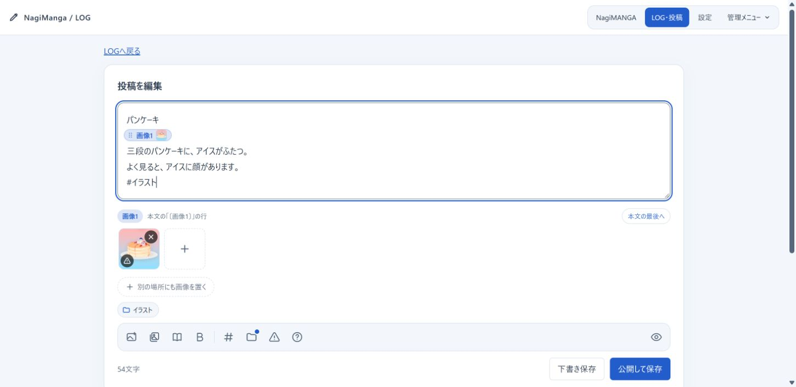
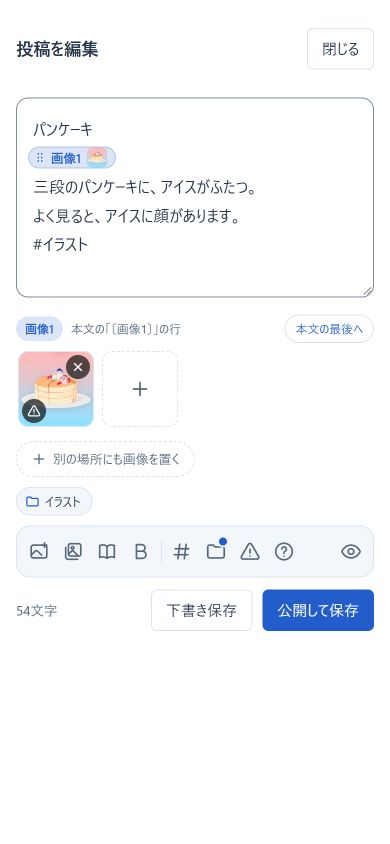
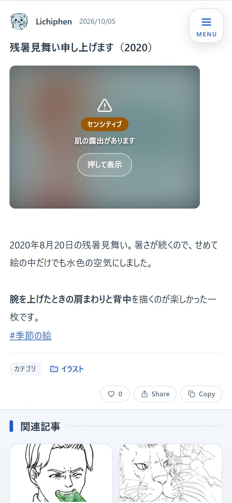
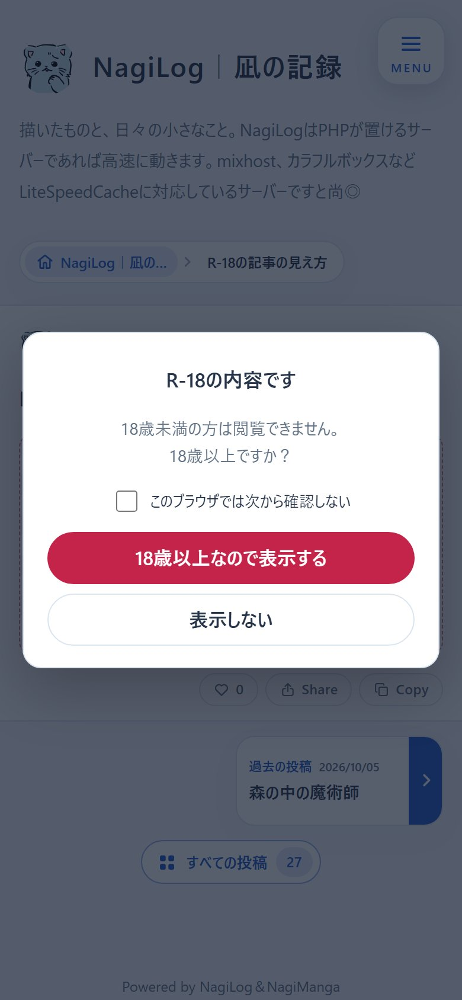
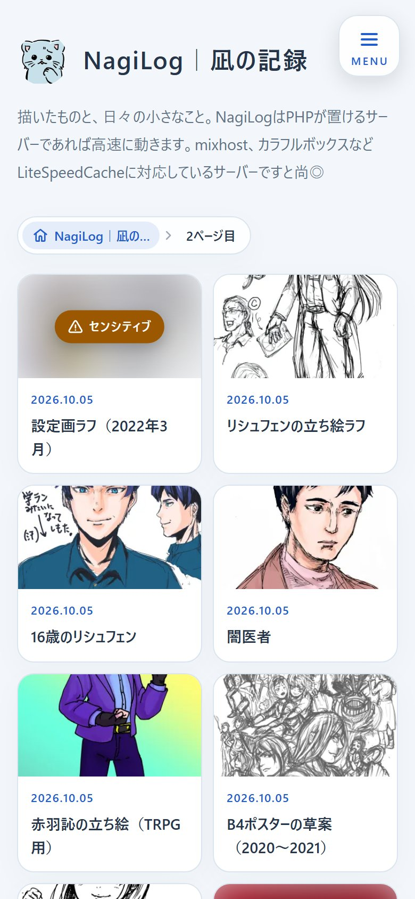
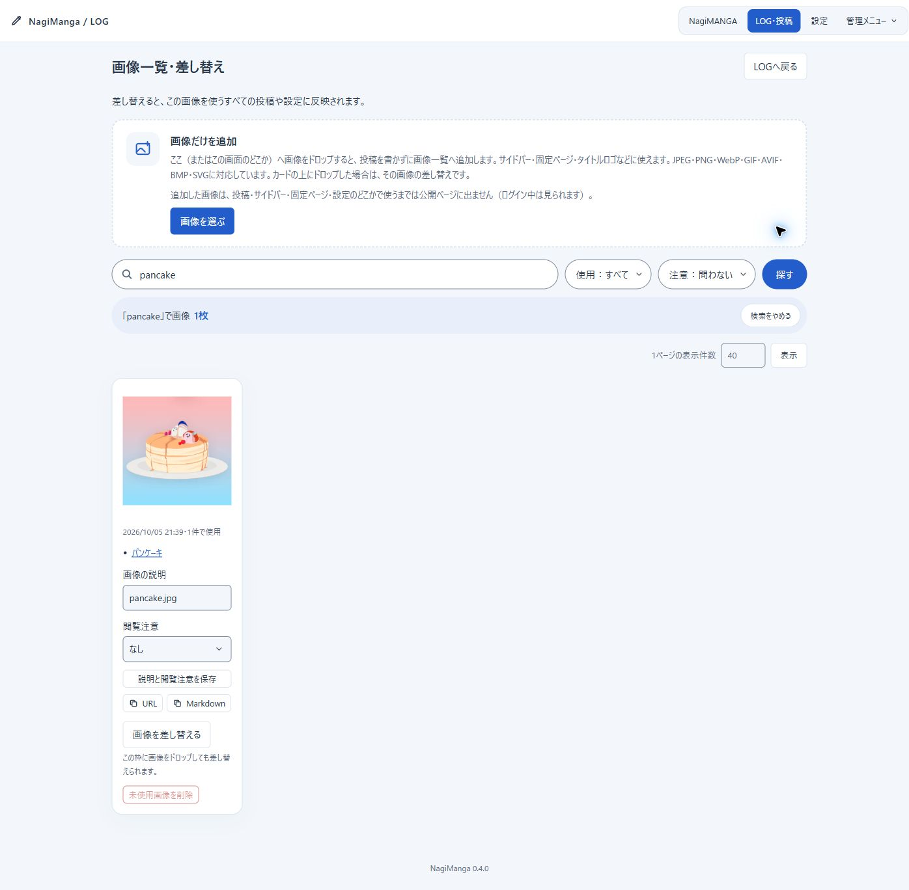
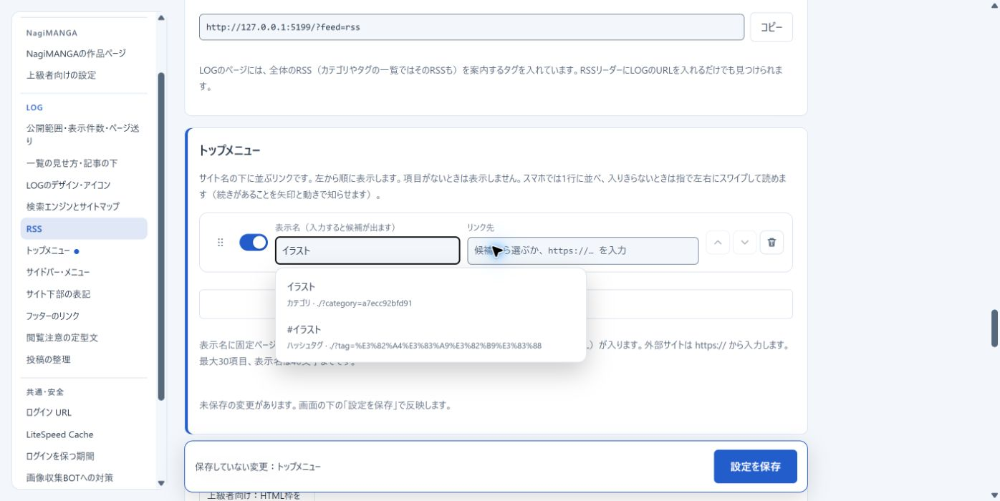
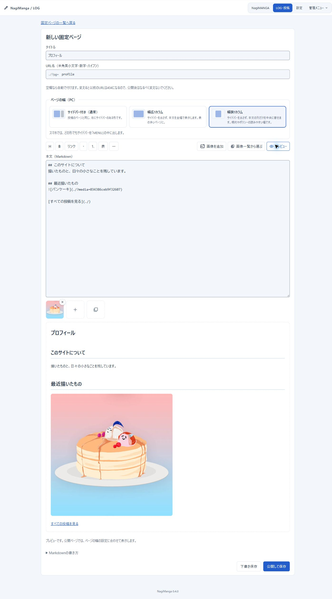

# NagiLog（個人用LOG）

文章、画像、漫画を、自分のサイトへ気軽に投稿できるLOGです。NagiSeries（[NagiSwipe](../README.md#nagiswipe)・[NagiManga](README.md)・NagiLog）の1つです。
データベースを使わず、NagiMangaの漫画管理とログインを共用します。
スマホの投稿画面は、NagiMemoの画面構成と操作の分け方を参考にしました。

NagiLogは、NagiManga v0.4.0から配布ZIPに含めています。

<!-- TOC -->
## 目次

- [デモ](#デモ)
- [仕様のまとめ](#仕様のまとめ)
- [画面](#画面)
- [できること](#できること)
- [メリット](#メリット)
- [デメリットと向いている規模](#デメリットと向いている規模)
- [設置とログイン](#設置とログイン)
- [設定と公開範囲](#設定と公開範囲)
- [ローカルで続けて使う](#ローカルで続けて使う)
- [公開URL](#公開url)
- [投稿、画像、漫画](#投稿画像漫画)
- [閲覧注意（センシティブ・R-18・R-18G）](#閲覧注意センシティブr-18r-18g)
- [SNSや動画の埋め込み](#snsや動画の埋め込み)
  - [ブログカード](#ブログカード)
- [画像の形式・容量・管理](#画像の形式容量管理)
- [動画と音声](#動画と音声)
  - [SVG](#svg)
- [記事と専用画像を削除する](#記事と専用画像を削除する)
- [カテゴリとハッシュタグ](#カテゴリとハッシュタグ)
- [デザインとキャッシュ](#デザインとキャッシュ)
  - [フッターのリンク](#フッターのリンク)
  - [LiteSpeed Cache](#litespeed-cache)
  - [キャッシュされない表示も速くする](#キャッシュされない表示も速くする)
  - [読み込み中の表示](#読み込み中の表示)
- [検索](#検索)
- [一覧の見せ方と関連記事](#一覧の見せ方と関連記事)
- [いいね](#いいね)
- [サイドバーの並び替えとHTML枠](#サイドバーの並び替えとhtml枠)
- [タイトルロゴと紹介文](#タイトルロゴと紹介文)
- [トップメニュー](#トップメニュー)
- [固定ページ](#固定ページ)
- [SEOとOGP](#seoとogp)
  - [パンくずリスト](#パンくずリスト)
  - [検索エンジンに載せない](#検索エンジンに載せない)
  - [サイトマップ](#サイトマップ)
  - [RSS](#rss)
  - [説明文（description）](#説明文description)
- [画像収集BOTへの対策](#画像収集botへの対策)
- [保存先を守る](#保存先を守る)
- [保存構造とバックアップ](#保存構造とバックアップ)
- [検証と残る確認](#検証と残る確認)
- [参照元と文章](#参照元と文章)
<!-- /TOC -->

## デモ

**https://notebook.lichiphen.com/nagimanga/**

作者が実際に使っているLOGです。公開側の表示、スマホのメニュー、メールのダイアログ、404を試せます。
投稿や設定の画面は、作者だけが使えます。ログインしたときの見え方は、下の「画面」で紹介します。
漫画ビューアーのデモ（[demo.html](https://notebook.lichiphen.com/nagimanga/demo.html)）と同じ設置です。1つの設置で、漫画の管理とLOGの両方が動きます。

## 仕様のまとめ

| 項目 | 内容 |
| --- | --- |
| 版 | 0.5.2（NagiManga v0.5.2に同梱） |
| 動作環境 | PHP 8.1以上（GD・fileinfo・mbstring）。バックアップとEPUBにはZipArchive、HTML枠とSVGにはDOM拡張も使います。HTTPSと、`.htaccess` が効くサーバー（Apache・LiteSpeed）をおすすめします |
| 保存 | データベースを使いません。投稿は1件ずつファイルで保存し、NagiMangaと保存先・ログインを共用します |
| 公開範囲 | 全体公開か、自分専用のMemo（ログインしたときだけ読める）を選べます |
| 投稿 | 本文の1行目がタイトルです。太字、URL、ハッシュタグ、画像・漫画のタグ、埋め込みを使えます。下書き、編集、画像の差し替えに対応します |
| 画像 | JPEG・PNG・GIF・WebP・AVIF・BMPを受け付け、読み直してWebPかJPEGで保存します（4096pxを超える画像は縮小、GIFアニメはGIFのまま）。上限は1〜200MBで設定でき、初期値は30MBです。SVGも内容を検査して取り込めます（2MBまで） |
| 閲覧注意 | 記事と画像に、センシティブ・R-18・R-18Gを付けられます |
| 埋め込み | YouTubeやXなど17パターンを、URLを1行に貼るだけで埋め込みます。対応していないページは、OGPを読んだブログカードで表示します |
| 一覧と表示 | ミニブログとタイル、3種類のページ送り、関連記事、いいね、検索、サイドバーの並び替えとHTML枠。デザインは6種類で、どれもWCAG 2.2 AAの色のコントラストを満たします |
| 検索エンジン・共有 | canonical、OGP、パンくずリスト（JSON-LD）、サイトマップ、RSS、すべてのページを検索に載せない設定 |
| 速さ | LiteSpeed Cacheに対応します。版番号付きのJS・CSSは、ブラウザーに1年保存させます |
| 安全 | パスワード、IP制限、試行回数の制限、CSP、画像収集BOTへの対策。ログインは30日（設定で1年）続きます |
| バックアップ | LOG用ZIPで保存・復元します。復元は画像を少しずつ変換し、進み具合を表示します |
| 規模 | 1人で使う、小さなサイト向けです |

## 画面

投稿欄・設定・画像一覧・固定ページの操作例は、2026年10月7日にローカルで撮影しています。本文や選択項目は説明用の例です。

**パソコン**: 左に投稿、右にプロフィールとリンク集を並べます。記事の上には、投稿した日付を表示します。


**スマホ**: 投稿は横幅いっぱいです。右上の「MENU」から、パソコンと同じサイドバーを開きます。
メールのボタンを押すと、アドレスをコピーするか、いつものメールアプリで送るかを選べます。

<table>
<tr>
<td align="center"><br>トップ</td>
<td align="center"><br>MENU</td>
<td align="center"><br>メールのダイアログ</td>
</tr>
</table>

**ログイン中**: トップページの先頭に投稿欄が出ます。画像は本文の下にサムネイルで並び、本文中に置いた画像は「画像1」のような目印で位置を確認できます。カテゴリや閲覧注意などは、道具のアイコンを押したときだけ下に開きます。選んだ項目は、本文の下にチップで表示します。

下へスクロールすると、サイドバーの右端にそろえた「書く」ボタンが出ます。記事・検索・分類などほかのページには投稿欄を出さず、開いてすぐ「書く」ボタンがふわっと現れます。

<table>
<tr>
<td></td>
<td></td>
</tr>
</table>

**404**: ブラックホールの中を描いています。ベージュの帯が波打ち、光の波が何度も打ち付けます。


## できること

| 機能 | 使い方・表示 |
| --- | --- |
| 投稿と下書き | ログインすると、トップページの先頭で書けます。投稿欄がスクロールで隠れると「ペン＋書く」が出ます。パソコンでは、サイドバーの右端にそろえて出します。ボタンは下からせり上がり、その上に「スパナ＋管理」のボタンが横から出ます。ほかのページでは投稿欄を出さず、2つのボタンが開いてすぐふわっと現れます。 |
| 太字とリンク | 選んだ文字を、道具の列の「B」（太字）で強調できます。トリプルクリックで行ごと選んでも、改行は太字の外に残します。本文のURLはリンクになります。HTMLは文字として表示します。 |
| 埋め込みとカード | URLだけを1行に貼ると、YouTubeやXなどはドメインを見て自動で埋め込みます。ほかのページは、OGPを使ったブログカードで表示します。 |
| 画像 | 選択、ドロップ、貼り付けで追加できます。サムネイルをまとまりごとに並べ、本文中の目印で表示位置を決められます。公開画像はNagiSwipeで拡大・縮小でき、GIFアニメも動いたまま表示します。 |
| 閲覧注意 | 記事と画像に「センシティブ」「R-18」「R-18G」を付けられます。読者には、センシティブは画像をぼかし、R-18・R-18Gは本文を折りたたみ、開く前に年齢を確認します。投稿欄から2回押すだけで付けられます。 |
| 漫画 | 新しい作品から、タイトルと表紙で選べます。本文に漫画カードを表示し、その場でビューアーを開けます。 |
| 編集と差し替え | 投稿を編集できます。「画像一覧・差し替え」で、画像の説明や画像そのものを変更できます。 |
| カテゴリ | 投稿時に作成・選択できます。LOG・投稿の「カテゴリ・タグ」で、名前と並び順を変更できます。 |
| ハッシュタグ | 本文の `#らくがき` などがリンクになります。投稿欄には、直近で使った8件を表示します。LOG・投稿から改名・並び替えできます。 |
| メール | リンク集にメールアドレスを登録できます。押した人は、コピーするか、既定のメールアプリで送るかを選べます。 |
| 検索 | サイドメニューの検索欄から、本文・タイトル・ハッシュタグ・カテゴリ名で探せます。管理画面の投稿一覧にも検索欄があり、下書きも探せます。 |
| サイドメニュー | プロフィールとリンク集、検索、カレンダー、最新の公開投稿3件、カテゴリ、ハッシュタグ、最終更新日を表示します。設定で並び替え・非表示にできます。 |
| HTML枠 | 上級者向けに、グリッドリンク・枠なしバナー・自由なHTMLのテンプレートから追加できます。 |
| スマホ表示 | 投稿は横幅いっぱいです。右上を追尾する、三本線と「MENU」の文字が入ったボタンからメニューを開けます。 |
| デザイン | ライト3種類、ダーク3種類から選べます。アイコンと共通のOGP画像も設定できます。 |
| 404 | 見つからないページに、ブラックホールの中を描いたアニメーションを表示します。端末の「動きを減らす」設定にも対応します。 |
| ログインの保持 | 最後にログインした日から30日間、ログインしたままです。設定で1年（365日）にもできます。 |
| 公開範囲 | 全体公開と、自分専用のMemoを選べます。Memoは記事とLOG画像をログイン時だけ表示します。 |
| ページ送り | 一覧の下に「新しい投稿」「過去の投稿」と、1・2・3…のページ番号を出します。全体の件数と今の位置（例: 124件中 51〜60件目）も表示します。記事のページには、前後の投稿と「すべての投稿」を出します。 |
| シェア | 公開中のLOGでは、各記事の下に「Share」と「Copy」を出します。どちらも「記事タイトル＋改行＋記事のURL」を使います。Share は、スマホでは端末の共有画面を、PCではX・はてなブックマーク・LINE・Instagramを選ぶ画面を開きます。Instagramは文を受け取る共有URLがないため、シェア文をコピーしてからInstagramを開く案内を出します。アイコンはサービスの公式ロゴではない独自の絵です（`server/viewer/link-icons/README.txt`）。 |
| いいね | 記事の下の「Share」の左に、ハートのボタンを出します。タップで1つ、長押しで10ずつ増えます。同じ回線・同じ端末から1つの記事に押せるのは1日100までです。設定でオフにできます。数は記事の編集画面で確認・変更・削除できます。 |
| 一覧の見せ方 | 記事を全文で並べる「ミニブログ」と、サムネイル・投稿日・タイトルを並べる「タイル」を選べます。新しい記事には「NEW」の印を付けます（期間と文字は設定で変更）。 |
| 関連記事 | 記事の下に、同じカテゴリやハッシュタグの記事を6件出します。ランダムか、更新が新しい順かを選べます。 |
| RSS・サイトマップ | LOG全体、カテゴリ別、ハッシュタグ別のRSSを出します。設定画面でURLを作ってコピーできます。検索エンジン向けのサイトマップも出します。 |
| 検索エンジン | 一覧の見せ方に合わせて、検索に載せるページを決めます。二次創作などのために、すべてのページを検索に載せない設定もあります。 |
| 投稿一覧 | 本文を省いた短い行に、日時・タイトル・小さな画像・記事を見る・編集・削除を並べます。いいねがある記事には、ハートと数を出します。一括削除も使えます。 |
| トップメニュー | サイト名の下に、固定ページ・カテゴリ・ハッシュタグなどへのリンクを並べられます。スマホでは左右にスワイプできます。 |
| 固定ページ | プロフィールや利用規約などをMarkdownで作れます。本文に画像を入れ、保存前にプレビューを確認できます。 |
| フッター | サイト下部の文章と、HOME・利用規約などへのリンクを別々に設定できます。 |
| バックアップ | LOG用のZIPで、投稿、下書き、画像、分類、公開範囲、表示設定、いいねの数を保存・復元できます。 |

投稿のタイトルは、入力本文の1行目です。
本文は2行目以降を表示し、タイトル行を繰り返しません。
タイトルは通常の見出し文字で表示します。太字やURL・ハッシュタグのリンクは2行目以降の本文で使えます。
タイトル行のハッシュタグも、分類には含めます。
長いタイトルは投稿の見出しに全文を表示し、サイドメニューや共有情報では80文字で省略します。
1行目の画像・漫画タグは本文へ残すので、消えません。
画像だけの投稿は「画像の記録」と表示します。

## メリット

- データベースの準備や移行が不要です。投稿は1件ずつファイルで保存します。
- 公開LOGと、自分だけのMemoを同じ仕組みで選べます。
- 文章、絵、漫画を同じ投稿欄に置けます。画像はまとまりの目印を動かし、漫画はタグを貼り直すと、表示位置を変えられます。
- 公開後に編集してもURLは変わりません。漫画の改題や画像の差し替えでも、本文との結び付きが残ります。
- NagiMangaの認証、画像変換、バックアップを使います。LOGのために別の管理者アカウントや外部サービスを増やす必要はありません。

## デメリットと向いている規模

個人が1人で使う、小さなサイト向けです。
複数の投稿者、コメント、フォローはありません。
検索は、保存した本文から言葉を探す簡単な仕組みです。表記ゆれを広く吸収する全文検索エンジンは使っていません。
大量の投稿や画像、アクセスが集中するサイトでは、ファイルの読み取りや保存時の待ち時間が増えます。
大量データでの負荷試験は、まだ行っていません。

本文は、太字、URL、ハッシュタグ、画像・漫画タグ、埋め込みを使う簡単な形式です。
投稿本文では自由なHTMLや、Wordのような編集機能は使えません。
サイドバーにはHTML枠を追加できますが、使える要素と属性を限定しています。
画像は読み直して保存するため、撮影情報などは残りません。GIFアニメはコマを保ったまま保存します。
SVGも使えますが、内容を検査し、描画に使う要素と属性だけを保存します。元画像を保管したい場合は、別に残してください。

同じ画像タグを使う投稿は、画像を差し替えるとすべて変わります。
一部の投稿だけ変えたいときは、新しい画像として追加してください。
カテゴリやハッシュタグを削除する専用画面はありません。名前変更と、各投稿から外す操作に対応します。

記事の削除は取り消せません。その記事だけで使っていた画像も削除するため、
残しておきたい記事や画像は、先にLOGのバックアップを保存してください。

## 設置とログイン

必要なのは、PHP 8.1以上と、GD、fileinfo、mbstringです。
バックアップと復元、漫画EPUBの取り込みにはZipArchiveも使います。
サイドバーのHTML枠とSVGの取り込みには、PHPのDOM拡張も必要です。
HTTPSで使い、保存先にPHPから書き込める権限を付けてください。

1. 配布ZIP（`nagimanga-v0.5.2.zip`）の `nagimanga/` をアップロードします。隠しファイルの `.htaccess` も送ってください。
2. 初回は `/nagimanga/admin/` を開き、30分以内に管理者パスワードを決めます。
3. 表示された管理用URLをブックマークします。
4. 設定の「共通・安全」にある「公開URL」に、`https://example.com/nagimanga` のように設置先を入力します。`log.php` は付けません。
5. 設定の「LOG」で、公開範囲、サイト名、紹介文、名前、デザイン、アイコンを選びます。
6. `data` が外から読めないことと、画像・漫画の表示を確認します。

製品の既定パスワードはありません。初回に自分で設定します。
管理者パスワードは10文字以上です。初回セットアップでは、現在のIPアドレスだけに管理画面を許可する設定がオンです。必要なら、あとから設定を変えられます。
公開LOGの「アイコン＋ログイン」からは、`admin/login.php` に入れます。
この入口のログイン条件も、パスワード、IP制限、試行回数の制限です。
同じIPアドレスから15分以内に5回ログインに失敗すると、一時的にログインできなくなります。

ログイン状態は、最後にログインした日から30日間続きます。ブラウザを閉じてもログインしたままです。
「設定 → 共通・安全」の「ログインを保つ期間」で、1年（365日）にもできます。


共用のパソコンでは、使い終わったらログアウトしてください。パスワードを変えると、ほかの端末はログアウトされます。
別のブラウザに同じCookieを持ち込んでも、ログインにはなりません。ブラウザの更新でバージョンが変わっても、ログインは続きます。
ゲスト（閲覧のみ）は、30分操作がないか、入ってから12時間で終わります。
スマホでIP制限を使うときは、自宅Wi-Fiと携帯回線の違いにも注意してください。

ソースから設置する場合は、`manga/server/` の中身に加えて、リポジトリの
`NagiSwipe-main.js` と `NagiSwipe-main.css` を設置先の `viewer/` にコピーします。
配布ZIPには、この2ファイルを含めています。
既存環境を更新するときは、先にバックアップを取り、プログラムを上書きしてください。
自分の `data/` と `lib/paths.php` は上書きしません。

## 設定と公開範囲

設定は「NagiMANGA」「LOG」「共通・安全」のタブに分けています。
漫画の作品ページはNagiMANGA、LOGの公開範囲やデザインはLOGで設定します。
ログイン、保存先のURL、画像の上限、BOT対策は共通です。
タブを移動しても入力は残ります。キーボードの左右キーでも、タブを移動できます。

保存ボタンは、画面の下に固定した「設定を保存」の1つだけです。3つのタブで変えた設定を、まとめて保存します。
変えたブロックは左端に線が付き、目次にも点が付きます。保存ボタンの横には、まだ保存していないブロックの名前が出ます。
送るのは変えたブロックだけです。どれか1つでも入力に誤りがあると、ほかのブロックも保存しません。そのブロックのタブを開いて誤りを知らせ、入力した内容は画面に残します。
保存すると画面を読み込み直し、サーバーで整えた値を表示します。
管理者パスワードとログインURLの変更は、すぐに効くため、それぞれのボタンで別に行います。

保存していない変更があるまま別のページへ移ろうとすると、確認の画面を出します。「編集に戻る」「保存せずに移動」「保存して移動」から選べます。
メニューやリンク、ログアウトのほか、ブラウザーの「戻る」やスマホの戻るスワイプでも確認します。タブを閉じる・再読み込みするときは、ブラウザーの確認を出します。

設定画面には目次があります。パソコンでは左の列に、3つのタブすべてのブロック名を並べます。
押すとそのタブに切り替えてブロックまで移動し、読んでいるブロックの名前を目次で強調します。
広い画面でも、目次と設定の2列にします。設定のブロックは1列に並べ、入力欄が横に広がりすぎないようにしています。
スマホでは、画面の右下に「目次」のボタンが浮かびます（保存ボタンの上）。押すと目次の画面が開き、1回押すだけで別のタブのブロックにも移動できます。
目次の一番上には「管理画面に戻る」（LOG・投稿）と「公開ページを見る」（新しいタブ）のボタンがあり、スマホの目次の画面にも同じボタンを出します。下までスクロールしていても、すぐに移動できます。
ブロックの中に小見出し（「新着の印」「パンくずリストの先頭」など）があるときは、ブロック名の下にその名前をラベルで並べます。押すとその項目まで移動し、閉じている折りたたみは開きます。目次にはブロック名だけを載せます。

下の例は「LOG」タブを開いた状態です。スマホの目次にも、3つのタブの設定項目をまとめて表示します。

<table>
<tr>
<td></td>
<td align="center"></td>
</tr>
</table>

LOGは既定で全体公開です。「自分専用のMemo」にすると、記事とLOG画像は管理者だけが読めます。
未ログイン、ゲスト、期限切れのセッションには、一覧・個別記事・分類ページ・画像を404で返します。
ログイン中のページと画像は`private, no-store`、公開ページは`Vary: Cookie`を指定します。
以前からログインしている場合は、管理画面を一度開き直すと、新しいCookieの範囲へ切り替わります。

Memoを全体公開へ切り替えると、保存済みの記事とLOG画像も公開されます。下書きは公開しません。
公開後に誰かが保存した画像や、外部サービスの既存キャッシュは回収できません。
NagiMANGAの作品は、LOGとは別の公開範囲です。作品のパスワードなどで管理してください。
Memoでも、保存先への直接アクセス拒否は必要です。後述の「保存先を守る」を確認してください。

サイトのメニューには、未ログインなら「ログイン」、管理者なら「管理ページ」と表示します。
「設定 → LOG → サイドバー・メニュー」で「ログイン・管理ページ」のスイッチをオフにすると、このブロックを隠せます。
入口を隠す場合は、管理URLを先にブックマークしてください。
スイッチをオフにしようとすると、管理用URLを表示した確認が開きます。「URLをコピー」「新しいタブで開く」でブックマークでき、「ブックマークした（隠す）」を選んだときだけオフになります。「まだ（表示したままにする）」やEscキーでは、オンのまま残ります。
ログインしていない状態で管理画面のURL（鍵なし）を開くと、「ログイン」を表示しているあいだは、パスワード欄だけのログイン画面へ移ります。ログイン後は管理画面の投稿一覧を開きます。リンクを隠しているときと、違う鍵を付けたときは、これまでどおり404です。
ログインの入口とパスワードによる保護は、設定をオフにしても残ります。

| 一覧 | 既定の件数 | 変更する場所 |
| --- | --- | --- |
| サイトのトップ・日付・月・カテゴリ・タグ | 10件 | 設定の「LOG → 1ページの投稿数」。共通で1〜100件を指定できます。一覧をタイルにする場合は、偶数がおすすめです。 |
| 管理画面の投稿一覧 | 20件 | 一覧上部の「1ページの表示件数」。1〜100件を指定できます。下には公開ページと同じ番号つきのページ送りを出します（画像一覧も同じ）。 |

管理画面の件数は、そのログインセッションの間だけ記憶します。
公開側の件数とは別なので、読者のページ送りには影響しません。
管理一覧はテーブルを使わず、短い行に日時・タイトル・サムネイル・記事を見る・編集・削除を並べます。
長いタイトルは一覧で省略します。編集画面では元の入力を確認できます。

公開側のページ送りは、「設定 → LOG → 公開範囲・表示件数・ページ送り」で選べます。

| 形式 | 表示 | 向いているLOG |
| --- | --- | --- |
| 番号つき（標準） | 「新しい投稿」「過去の投稿」と、`1 … 5 6 7 … 13` のようなページ番号。8ページ以上あると、ページ番号を入力して移動する欄も出します。 | 投稿が多く、前に読んだ場所へ戻りたい読者がいるLOG |
| 新しい・過去だけ | 「新しい投稿」「過去の投稿」の2つのボタン | 投稿が少ないLOG、すっきり見せたいLOG |
| もっと見る | 押すと、同じページの下に続きの投稿を足すボタン | スマホで続けて読まれるLOG |

どの形式も、ページ送りは普通のリンクです。JavaScriptが動かなくても次のページへ進め、検索エンジンも2ページ目以降をたどれます。
自動で続きを読み込む「無限スクロール」にはしていません。フッターやサイドメニューに届かなくなり、戻ったときに読んでいた位置も失いやすいためです。
「もっと見る」で読み込んだあとは、アドレスを読み込んだページの番号に変えます。再読み込みした場合は、そのページから表示し、「最新の投稿から見る」で先頭へ戻れます。
「新しい投稿」は左、「過去の投稿」は右に固定しています。最初や最後のページでも、押せないボタンとして同じ位置に残すので、続けて押しても位置がずれません。
スマホでは、ページ番号を上に、2つのボタンを下に横幅いっぱいで並べます。

あわせて、次の2つも選べます。どちらも標準はオンです。

- 「124件中 51〜60件目」のような、全体の件数と今の位置
- 記事のページの下に出す、前後の投稿と「すべての投稿」

「すべての投稿」は、サイドメニュー・カテゴリやタグの一覧・記事のページで同じ見た目のボタンにそろえ、全体の件数を添えます。
最後のページより先の番号（例: 投稿が13ページ分なのに `?page=99`）は、空の一覧ではなく404を返します。

## ローカルで続けて使う

作業中のLOGは、`http://127.0.0.1:5197/`で確認できます。
サーバーを終了したあとも、PowerShellでリポジトリのルートから次を実行すると、
同じ投稿・画像・設定を使って再開できます。

```powershell
powershell -NoProfile -ExecutionPolicy Bypass -File .\manga\dev\start_preview.ps1
```

どのフォルダーで開いたPowerShellからでも、ファイルの場所を絶対パスで書けば起動できます。
次の例は、リポジトリを`D:\000_tool\NagiSwipe`に置いた場合です。

```powershell
powershell -ExecutionPolicy Bypass -File D:\000_tool\NagiSwipe\manga\dev\start_preview.ps1 -Lan
```

Claude Codeの入力欄で実行するときは、先頭に`!`を付けます。自分で開いたPowerShellでは`!`を付けません。

保存先は`manga/dev/results/log-preview-data`です。2回目以降の起動では、データを作り直しません。
終了は`Ctrl+C`です。すでに5197番でサーバーが動いている場合は、その案内だけを表示します。
別のアプリが使っているときは`-Port 5199`のように番号を変えてください。

初めて起動するときは、このPCにあるサンプル（`manga/dev/sample/`の2つのZIP）から投稿・画像・漫画・設定を復元します。
サンプルは確認用の素材なので、リポジトリと配布ZIPには含めません。ZIPがない場合は、空のLOGで始めます。
サンプルの管理パスワードは`log-test-password`です。このPCで確認するためだけに使ってください。
ZIPはアプリのバックアップ機能で作るため、管理パスワードのハッシュ・秘密鍵・ログイン鍵は含みません。設置のたびに新しく作ります。
サンプルの作成にはPython 3が必要です。

| 追加の指定 | 動き |
| --- | --- |
| `-Lan` | 同じWi-Fiのスマホからも開けるようにし、スマホ用のURLを表示します。 |
| `-Reset` | サンプルからやり直します。今までの保存先は日時付きの名前で残します。 |
| `-Empty` | サンプルを使わず、空のLOGで始めます。管理URLからパスワードを決めます。 |

今のプレビューの内容を新しいサンプルにするときは、プレビューを起動したまま`python manga/dev/sample_data.py export`を実行します。

`demo-site`の予行演習は、見本漫画用の一時データを毎回作り直す別の道具です。
このLOGを続けて使う場合は、上の起動方法を使ってください。

## 公開URL

| ページ | URLの例 |
| --- | --- |
| トップ | `https://example.com/nagimanga/` |
| 個別投稿 | `https://example.com/nagimanga/?id=20261004123033` |
| カテゴリ | `https://example.com/nagimanga/?category=abcdef123456` |
| ハッシュタグ | `https://example.com/nagimanga/?tag=らくがき` |
| 日付・月 | `?date=2026-10-04` / `?month=2026-10` |
| 固定ページ | `https://example.com/nagimanga/?pg=profile` |

記事の上には、個別投稿へのリンクとして日付（例：`2026/10/04`）だけを表示します。時刻は、マウスを重ねると出ます。
投稿番号は、初めて公開した日本時間の年・月・日・時・分・秒です。
同じ秒に重なると `20261004123033-02` のように連番を付けます。
下書きには仮番号を使い、初回公開時に日時の番号へ変えます。
公開後に下書きへ戻した投稿は、再公開しても同じURLです。

以前の `log.php` と `log.php?id=…` は、対応する新URLへ301転送します。
サーバーでは `index.php` をディレクトリの入口にしてください。
PHPのファイル名をURLから外すだけで、安全性が高まるわけではありません。
認証、保存先の保護、入力の検証は別に必要です。

「公開URL」を空欄にすると、アクセス時のHostから共有URLを作ります。
公開前に正しいURLを設定し、canonicalとOGPが自分のドメインになることを確認してください。

## 投稿、画像、漫画

管理者としてログインすると、トップページの先頭に投稿欄が、各記事に編集ボタンが出ます。公開ページ（記事ページや記事一覧）から「編集」を開いた場合は、編集画面の上に「記事ページに戻る」（一覧からなら「公開ページに戻る」）が出ます。これや、スマホの「閉じる」、保存後のダイアログから、元のページの同じ記事の位置に戻れます。管理画面の記事一覧から開いた場合は「投稿一覧に戻る」だけです。
投稿欄が画面の上へ隠れると「ペン＋書く」が表示され、投稿画面を開けます。
トップページ以外（記事、検索、分類、日付、2ページ目以降）では、投稿欄を出さずに「ペン＋書く」をすぐ表示します。
管理一覧では「新しく書く」から開きます。Memoの保存ボタンは「メモを保存」です。

投稿欄は、本文、本文の画像、設定した項目のチップ、道具のアイコン1列でできています。

| アイコン | 動き |
| --- | --- |
| 画像・動画・音声を追加・メディア一覧から選ぶ | 最後に操作した画像のまとまりへ追加します（動画・音声も同じ列に並びます）。 |
| 漫画を選ぶ | 本文のカーソル位置に漫画のタグを入れます。 |
| B | 選んだ文字を太字にします。 |
| H | 行を見出しにします（下の「見出し」）。 |
| #・フォルダー・注意の三角・? | 最近のハッシュタグ、カテゴリ、閲覧注意、使い方を、道具の列の下に1つずつ開きます。 |
| 目 | プレビューを開く・閉じる。 |

カテゴリや閲覧注意を設定すると、本文の下にチップで表示します。チップを押すと、その設定を開きます。
画像・動画・音声（メディア）は、SNSの投稿のように本文欄の下にサムネイルで並べます。本文欄にはメディアのタグを出しません。
メディアは「メディア1」「メディア2」のような**まとまり**ごとに1行で並び、まとまりごとに本文の中の置き場所を決められます。
- 追加したメディアは、本文のカーソル位置に `〔メディア1〕` のような目印の行で置きます。本文の最後に置くときも目印の行を入れるので、本文欄を見れば、どこに入ったかがわかります。
- カーソルの後ろに文があれば、その行の下に目印の行を作ります（行の頭にカーソルがあるときは、その行の上）。文の途中で切ることはありません。カーソルが目印の行にあるとき（すぐ下の行の頭も含む）は、そのまとまりに足します。一度に追加した分は、同じまとまりに入ります。
- 置いた場所は、送っている間から欄の下のメッセージ（「本文のカーソル位置（「〔メディア2〕」の行）に置きます」など）で知らせ、本文の中の帯とその下のまとまりの列を光らせます。帯が本文欄の外にあるときは、見える位置まで本文欄を動かします。
- まとまりの＋から追加したときは、カーソルの位置にかかわらず、そのまとまりに入ります。
- 投稿を開き直したときも、本文の最後のまとまりを含め、すべてのまとまりに目印の行を付けて表示します。
- 「本文の最後へ」で目印の行を消すと、そのまとまりは本文の最後に並びます（目印のないまとまりは本文の最後）。
- 文の途中に置くときは、まとまりの「カーソルの位置へ」で、本文のカーソル位置に目印の行を入れることもできます。保存すると、その行がそのまとまりのタグに置き換わります。
- 別の場所にも置くときは「別の場所にもメディアを置く」を押します。カーソル位置に新しい目印の行と、空のまとまりができます。まとまりの＋から追加します。
- 本文の中の目印の行には、テーマのアクセント色の帯と小さなサムネイルを重ねて表示します。帯をドラッグすると、目印の行を別の行へ動かせます（離した行の上に入ります。最後の行より下で離すと本文の最後）。
- サムネイルをドラッグすると、まとまりの中の並べ替えや、別のまとまりへの移動ができます。スマホは長押ししてから動かします。キーボードでは、サムネイルを選んで左右の矢印キーで並べ替え、上下の矢印キーで前後のまとまりへ移します。
- 右上の×で、その投稿から外せます。ファイルそのものはメディア一覧に残ります。
- 番号は書いているあいだは変えません（消した目印を元に戻すと、同じまとまりに戻ります）。投稿を開き直すと、上から順に振り直します。
- 以前の `〔画像1〕` の形の目印も、そのまま使えます。

メディアを文の途中に置いた例です。本文の目印と、その下のサムネイルの列が対応しています。「本文の最後へ」を押すと目印が消え、本文の最後へ戻します。

<table>
<tr>
<td></td>
<td align="center"></td>
</tr>
</table>

本文欄に画像タグを手で書いたり貼り付けたりすると、まとまりに移します。後ろに文があればその位置に新しいまとまりを作り、なければ本文の最後のまとまりに入れます。
以前の書き方の投稿（本文に画像タグを書いた投稿）は、開くと画像の並びごとにまとまりへ分けます。2か所以上に分かれていても、そのまま編集できます。
サムネイルや本文の画像を本文欄へドラッグしても、同じ画像をもう一度アップロードしません。

本文を入れ、「投稿する」か「下書き保存」を選びます。本文の上限は100,000バイトです。
未保存の入力は、このタブの保存領域にも残します。
別の端末への同期や正式なバックアップにはならないので、書き終えたら保存してください。
公開ページの「書く」欄の書きかけは、同じタブで開いた別の記事でも戻します。書きかけがあるあいだは「書く」ボタンに点が付きます。
戻した書きかけは「書きかけを消す」で消せます。
ページを移る前の確認は、そのページで入力したときだけ出します。戻しただけの書きかけはタブに残るため、確認しません。
別タブで先に編集された場合は、その上へ保存せず、開き直すよう案内します。

画像のタグは `[Image:画像番号]`、漫画のタグは `[Mangaタイトル名]` です。
保存される本文では、画像も漫画もこのタグで書かれています。漫画のタグや、以前の書き方の投稿の画像タグは、切り取って貼り直すと本文中の位置を変えられます。
画像タグを改行だけで続けて並べると、正方形のサムネイルを並べたギャラリーにします（NagiMemoと同じ形）。スマホは2列、PCは3枚以上なら3列です。2枚と4枚は、PCでも2列で並べます。あいだに文字があれば別の並びになり、1枚だけのときは今までどおり元の比率で出します。押すと元の画像を拡大表示します。
画像・ギャラリー・漫画のカード・埋め込み・ブログカードのすぐ次の行に書いた文は、空行を挟まずに続けます。間を空けたいときは、空行を1行入れてください。
同名の漫画は、タグに識別番号を添えて区別します。
漫画の改題後も作品IDで結び付けるため、以前の投稿から読めます。

パスワード付き漫画は、公開カードに表紙を出さず、読むときにパスワードを確認します。
個別ページを非公開にした漫画も、カードの表紙には共通画像を使います。
未ログインでは、LOGの下書きと、それだけに使っている画像は404になります。
全体公開のLOGでは、アイコンと共通OGPの画像も公開します。
自分専用Memoでは、この画像も管理者としてログインしたときだけ読めます。
画像一覧からの削除では、投稿、下書き、アイコン、共通OGP、サイドバーで使っている画像を保護します。

### 見出し

本文の行頭に `## ` を付けるとその行は見出し２（h2）、`### ` で見出し３（h3）になります。公開ページでは、見出し２は下線、見出し３は左の線で表示します。

Markdownを書かない場合は、投稿欄の「H」を使います。押すと「見出し２」「見出し３」を選ぶ画面が出ます。

- 文字を選んでいるときは、その行を見出しにします。何も選んでいないときは、カーソルのある行です。
- 空の行では `## 見出し２` を入れ、「見出し２」の部分を選んだ状態にします。そのまま打ち替えられます。
- 同じ見出しをもう一度選ぶと、元の行に戻ります。

「設定 › LOG › 一覧の見せ方・記事の下 › 投稿欄の見出しボタン」で、ボタンに出す見出しを選べます。1つだけなら押すとすぐ入り、両方外すとボタンを隠します。h4以下は、読み手にも検索にもあまり役立たないため用意していません。

## 閲覧注意（センシティブ・R-18・R-18G）

肌の露出が多い絵、性的な絵、流血やグロテスクな絵を、読者が心の準備をしてから見られるようにします。
記事にも画像にも付けられます。画像に付けた区分は、その画像を使うすべての記事・タイル・関連記事に効きます。

| 区分 | 向いている内容 | 読者の見え方 |
| --- | --- | --- |
| なし | ― | そのまま表示します。 |
| センシティブ | 肌の露出、軽い流血など | 画像をぼかし、「押して表示」で開きます。本文はそのまま読めます。 |
| R-18 | 性的な表現 | 本文と画像を折りたたみます。開く前に「18歳以上ですか？」と確認します。 |
| R-18G | 強い流血・暴力・グロテスク | 本文と画像を折りたたみます。R-18と同じく、開く前に年齢を確認します。 |

<table>
<tr>
<td align="center"><br>センシティブ</td>
<td align="center"><br>R-18の年齢確認</td>
<td align="center"><br>タイル</td>
</tr>
</table>

**付け方**

- 記事ごと: 道具の列の注意の三角を押し、区分を選びます（2回）。任意で「流血表現があります」のような注意書きを40文字まで付けられます。入力欄の下の定型文（流血表現・肌の露出・性的な表現・暴力表現・グロテスク・ホラー・死を扱う内容・虫・苦手な方はご注意ください）を押すと欄に入り、そのまま書き足せます。定型文は「設定 → LOG → 閲覧注意の定型文」で、1行に1つ（40文字まで・30個まで）書き換えられます。空にして保存すると標準の9つに戻ります。「選んだとき、本文の画像にも同じ注意を付ける」がオンなら、その時点の本文の画像にも同じ区分を付けます。
- 画像ごと: 本文の下のサムネイルの左下のボタンを押し、区分を選びます（2回）。1つの記事で、1枚だけ区分を変えることもできます。
- あとから: 「画像一覧・差し替え」で、画像ごとに変えられます。

記事に付けた区分と画像の区分のうち、強いほうを記事の区分として使います。強さは、なし → センシティブ → R-18G → R-18 の順です。
たとえば、記事は「なし」でも、R-18の画像を1枚含むなら、その記事はR-18として折りたたみます。
投稿欄のチップには、画像から決まった区分を「R-18（画像）」のように表示します。

**読者の側**

- 一度開くと、「このブラウザでは、次から確認せずに表示しますか？」と聞きます。選ぶと、そのブラウザでは同じ区分を最初から表示し、タイルのぼかしも外します。ページの下の「閲覧注意を毎回確認する」で戻せます。
- R-18・R-18Gの年齢確認は、そのタブを閉じるまで覚えます（どちらかで答えれば、もう一方でも聞きません）。「このブラウザでは次から確認しない」にチェックすると、その区分は次から聞かずに開きます。
- 覆っている間は、画像の拡大用リンクを外しています。NagiSwipeで隣の画像へめくっても、まだ開いていない画像は出ません。
- JavaScriptが動かないブラウザでも、押せば開きます（`<details>`）。その場合、年齢確認は出ません。

**共有と検索**

| 場所 | 閲覧注意のある記事 |
| --- | --- |
| OGP（共有カード） | 注意のない画像があれば、その最初の1枚を使います。注意つきの画像しかない記事（記事全体に注意を付けた記事も）は、その画像を強くぼかし、区分の名前を重ねたWebPを自動で作って使います（下の「SEOとOGP」）。 |
| 説明文・RSS | R-18・R-18Gは本文を出さず、「閲覧注意（R-18）の記事です。」と注意書きにします。センシティブは今までどおりです。 |
| 検索エンジン | R-18の記事は`noindex,follow`にし、サイトマップにも載せません。 |
| タイル・関連記事 | サムネイルをぼかし、区分のラベルを重ねます。 |
| 管理画面 | ぼかさずに表示し、区分のラベルと「読者には…表示します」の案内を出します。投稿一覧のタイトルにも区分を添えます。 |

閲覧注意は、読者が見る前に準備するための表示です。アクセス制限ではありません。
画像のURLを直接開けば見られますし、年齢確認は自己申告です。公開できない画像は、そもそも投稿しないでください。
タイトル（本文の1行目）は折りたたまずに表示します。タイトルにはきつい言葉を入れないでください。

## SNSや動画の埋め込み

URLだけを1行に貼ると、ドメインを見て自動で埋め込みます。特別な書き方はいりません。
URLを貼ると埋め込まれる仕組みは、ほかのブログやCMSにもよくある機能です。NagiLogでは独自に組み立てており、埋め込みに対応していないページも、OGPを読んだブログカードで表示します（下の「ブログカード」）。
文の途中に書いたURLは、埋め込まずに普通のリンクにします。紹介したいときは単独の行に、話の中で触れるだけなら文中に書いて使い分けます。

| 埋め込むもの | 貼るURLの例 |
| --- | --- |
| YouTube（動画・ショート・ライブ・再生リスト、`t=`の開始位置） | `https://youtu.be/動画ID`、`https://www.youtube.com/watch?v=…` |
| ニコニコ動画 | `https://www.nicovideo.jp/watch/sm9`、`https://nico.ms/sm9` |
| Spotify（曲・アルバム・プレイリスト・アーティスト・ポッドキャスト） | `https://open.spotify.com/track/…` |
| Apple Music（曲・アルバム・プレイリスト） | `https://music.apple.com/jp/album/…` |
| Amazon Music 日本版（曲・アルバム・プレイリスト） | `https://music.amazon.co.jp/albums/…?trackAsin=…`、`https://music.amazon.co.jp/playlists/…` |
| SoundCloud（公開曲・プレイリスト） | `https://soundcloud.com/ユーザー名/曲名`、`https://soundcloud.com/ユーザー名/sets/プレイリスト名` |
| YouTube Music（曲・動画・プレイリスト） | `https://music.youtube.com/watch?v=…`、`https://music.youtube.com/playlist?list=…` |
| Bandcamp（曲・アルバム） | `https://アーティスト名.bandcamp.com/track/…`、`/album/…` |
| TikTok（動画・写真の投稿） | `https://www.tiktok.com/@ユーザー名/video/番号`、`/photo/番号` |
| Blueskyの投稿 | `https://bsky.app/profile/アカウント名/post/投稿ID` |
| Mastodonの公開投稿 | `https://サーバー名/@ユーザー名/投稿番号` |
| Mixcloud（公開番組・プレイリスト） | `https://www.mixcloud.com/ユーザー名/番組名/`、`/playlists/名前/` |
| Audiomack（曲・アルバム・プレイリスト） | `https://audiomack.com/ユーザー名/song/…`、`/album/…`、`/playlist/…` |
| Facebook（公開投稿・動画・リール） | `https://www.facebook.com/ページ名/posts/投稿ID`、`/videos/動画ID`、`/reel/動画ID` |
| Threadsの公開投稿 | `https://www.threads.com/@ユーザー名/post/投稿ID`（`threads.net`も対応） |
| Vimeoの動画 | `https://vimeo.com/動画ID`（限定公開のハッシュ付きURLも対応） |
| Twitch（配信・録画・クリップ） | `https://www.twitch.tv/チャンネル名`、`/videos/動画ID`、`https://clips.twitch.tv/クリップID` |
| X（Twitter）のポスト | `https://x.com/ユーザー名/status/番号` |
| Instagramの投稿・リール | `https://www.instagram.com/p/…`、`/reel/…` |
| CodePen | `https://codepen.io/ユーザー名/pen/…` |
| note、Voicy、Steam | 記事・チャンネル・ストアのページのURL |
| マンガ（少年ジャンプ＋などGigaViewerの19サイト） | `https://shonenjumpplus.com/episode/番号` |
| 動画ファイル（mp4・webm・ogv・mov・m4v） | `https://example.com/movie.mp4` |

1行目が埋め込みのURLだけの投稿は、「YouTubeの記録」のようなタイトルになります。説明文では「（YouTube）」と表示します。
配色がダークのときは、Xの埋め込みもダーク表示にします。プレビューでも埋め込みを確認できます。

Amazon Musicは、曲を聴いているときの「共有」からコピーしたリンクを、そのまま1行に貼れます。
たとえば、`https://music.amazon.co.jp/albums/B0CY5SN6Y4?trackAsin=B0CY5ST1FH` は「ポッケ村のテーマ」のプレーヤーになります。
曲の指定がないアルバムのリンクや、プレイリストのリンクは曲一覧を表示します。
Amazon公式の試聴プレーヤーなので、フル再生を保証するものではありません。
投稿の配色を変えても、プレーヤー内部はAmazonのデザインのままです。
`music.amazon.co.jp` の通常の共有リンクに対応しています。短縮URLは、開いた先のURLを貼ってください。

SoundCloudも「共有」でコピーした通常のリンクを、そのまま1行に貼れます。
たとえば、`https://soundcloud.com/sei_peridot/sets/peritunematerial` は、曲一覧のあるプレイリストになります。
曲は波形が見えるプレーヤーで表示し、ページを開いただけでは再生しません。
文の途中のURLは普通のリンクのままです。短縮URLは、開いた先のURLを貼ってください。
非公開リンクには対応していません。埋め込みを許可していない曲や削除された曲は、SoundCloud側の表示に従います。

YouTube MusicのURLは、YouTubeのプレーヤーで表示します。
Bandcamp、Bluesky、Mastodonは、保存やプレビューのときに曲や投稿の情報を確認します。
確認できないときは、元のページを開くリンクを表示します。
たとえばMastodonは、サーバーが返す公式の埋め込み先が、その投稿と一致するかを確認します。
外部から受け取ったHTMLを、そのまま本文へ貼ることはありません。

確認した情報は`data/log/embeds/`に保存します。1週間以内の再保存では取り直しません。
取得に失敗した場合は、翌日以降に保存やプレビューを開くと再確認します。
ブログカードと同じく、取得先の公開アドレス、時間、転送回数、容量を制限します。
読者が投稿を見るときは、保存済みの情報を使い、外部へは問い合わせません。
バックアップの復元などで引っ越した直後は、この情報がありません。管理者としてログインした状態で記事や一覧を開くと、足りない分をその場で取りに行きます（投稿を保存し直しても取り直します）。

追加したサービスの枠には、元の投稿を開くリンクも付けます。
Facebookの枠は、投稿の中身に合わせて高さを変えます。
Facebook、Instagram、Threadsなどは、公開設定、ログイン状態、地域やCookieの設定で表示が変わることがあります。
短縮URLや共有画面専用のURLは、通常の投稿URLに開き直してから貼ってください。
Twitchは設置先のドメイン名を自動で指定します。公開サイトはHTTPSで開いてください。
Twitchの枠は最小400×300pxです。縦向きの小さいスマホ画面ではプレーヤーを出さず、「横向きにすると表示されます」という案内とTwitchで開くリンクを表示します。

埋め込みの枠は、URLから読み取ったIDを使って、このプログラムが組み立てます。
本文に`<script>`を書き出すことはありません。X、Instagram、noteの公式スクリプトは、その埋め込みがあるページだけで`viewer/log-embed.js`が読み込みます。
セキュリティ設定（CSP）で、埋め込みの枠は上の各サービスだけ、外部のスクリプトはX・Instagram・noteだけに限っています。
YouTubeは、Cookieを使わない`youtube-nocookie.com`で埋め込みます。

埋め込みを表示すると、訪問者のブラウザが各サービスへ接続します。IPアドレスなどがそのサービスに伝わり、サービス側のCookieが使われる場合もあります。
削除された投稿や非公開の投稿は、各サービスの表示に従います。必要に応じて、サイトのプライバシーポリシーに書いておいてください。

### ブログカード

埋め込みに対応していないURLを1行に貼ると、そのページのOGP（タイトル・説明・サイト名・画像）を使ったカードで表示します。
OGPがないページは、`<title>`と説明文を使います。取得できないページは、普通のリンクのままです。

ページを読みに行くのは、管理者が投稿を保存したときと、プレビューを開いたときだけです。訪問者がページを見るたびに外部へ取りに行くことはありません。
取得した内容は`data/log/cards/`に保存し、1週間たってから保存し直したときに取り直します。読めなかったページは、翌日以降の保存で再び試します。
カードの画像は、このサーバーに取り込んで縮小し、読み直して保存します。訪問者のブラウザは外部サイトへ接続せず、画像の中に隠したデータも残りません。

外部のページを読み込むため、次の制限を設けています。

- 読みに行けるのは`http`と`https`の80番・443番ポートだけです。URLにユーザー名やパスワードを含むものは読みません。
- 名前解決した先が、ループバック、社内向けの範囲、リンクローカル（クラウドのメタデータを含む）、CGNAT、予約済みの範囲なら読みません。確かめたアドレスにだけ接続し、名前解決のすり替えも防ぎます。
- 転送は3回まで、転送先も同じように確かめます。ページは1MB、画像は8MBまで、1回の保存で10件・合計20秒までです。
- 文字コードはShift_JISやEUC-JPにも対応します。カードの文字はHTMLとして解釈せず、エスケープして表示します。

LOGのバックアップには、カードの保存内容は含めません。引っ越し先では、その投稿を保存し直すとカードを作り直します。

## 画像の形式・容量・管理

画像はJPEG、PNG、GIFに加えて、WebP、AVIF、BMPを受け付けます。WebP・AVIF・BMPの取り込みには、サーバーのGDが各形式の読み込みに対応している必要があります。取り込んだ画像はサーバーで読み直して保存し、WebPを書き出せる環境ではWebP、それ以外ではJPEGに変換します。縦か横が4096pxを超える画像は、Xと同じく4096×4096に収まるよう縮小してから保存します（縦横比はそのまま、透過も保ちます）。ファイルが軽くなり、スマホでも拡大表示が崩れにくくなります。縦に長い画像は、横幅もそれに合わせて小さくなります。GIFアニメと、NagiMANGAの漫画のページは縮小しません。

2コマ以上のGIFアニメは、GIFのまま保存します。本文の小さな表示も、NagiSwipeでの拡大表示も動きます。
GDはアニメーションを書き出せないため、GIFの中身を区切りごとに読み、絵を描く部分だけで組み直します。
コマの画像、表示時間、繰り返しの指定は残し、コメント、独自のデータ、終わりの印より後ろのデータは捨てます。
画像に紛れ込ませたPHPやHTMLは、この組み直しで残りません。配信も`image/gif`と`nosniff`の指定で行います。
コマは3,000枚まで、コマ数×縦×横は15億画素までです。1コマだけのGIFや、形の崩れたGIFは、これまでどおりWebPかJPEGに変換します。

画像の上限は「共通・安全 → 設置先と画像アップロード」で1〜200MBに設定できます。初期値は30MBです。PHPの`upload_max_filesize`もアップロードできる容量に影響します。画像は一辺16,000px、総画素数5,000万までです。画像処理に必要なメモリが足りない場合も取り込めません。

画像の画質も共通設定で調整でき、60〜100の範囲で指定します。初期値は90です。

「メディア一覧・差し替え」（以前の「画像一覧・差し替え」）は1ページ40件で、一覧の上の「1ページの表示件数」で1〜100件に変えられます（ログイン中は覚えます）。上の検索欄では、画像の説明（最初はファイル名）、その画像を使っている記事のタイトル、アイコン・共通OGP・サイドバーでの使用、追加した日付で探せます。「使用中・未使用」と「注意あり・なし」（閲覧注意）でも絞り込めます。説明を保存したり画像を削除したりしたあとも、同じ検索結果とページに戻ります。各画像の説明を300文字まで編集でき、使用件数と、使っている記事（編集画面へのリンク）、アイコン・共通OGP・サイドバーでの使用状況を確認できます。「画像を差し替える」から選ぶほか、差し替えたい画像の枠へ新しい画像をドラッグ＆ドロップしても差し替えられます。画像を差し替えると、同じ画像タグを使う投稿や設定すべてに反映されます。削除できるのは未使用の画像だけです。投稿、下書き、アイコン、共通OGP、サイドバーで使っている画像は削除できません。

「メディア一覧・差し替え」の上の「メディアだけを追加」に画像をドロップする（この画面のどこへドロップしても同じです）か、「ファイルを選ぶ」から選ぶと、投稿を書かずに画像だけを追加できます。複数枚まとめて追加できます。サイドバーのHTML枠、固定ページ、タイトルロゴなどに使う画像を先に置いておけます。画像の枠の上にドロップした場合は、これまでどおりその画像の差し替えです。追加しただけの画像は、投稿・サイドバー・固定ページ・設定のどこかで使うまで、公開ページでは404です（ログイン中は見られます）。各画像の「URL」「Markdown」ボタンで、`./?media=…` のURLと、固定ページに貼る `` をコピーできます。

画像一覧では、上の枠から画像だけを追加し、検索欄で必要な画像を探せます。各画像の「URL」「Markdown」は、固定ページやHTML枠へ貼る文字列のコピーに使います。「画像を差し替える」は、すでに使っている画像の内容を変更します。



### SVG

SVGもアップロードできます（投稿、画像一覧、アイコン、タイトルロゴ）。SVGは絵ではなく文書なので、プログラムやほかのサイトへの参照を入れられます。そこで取り込む前に簡易のウイルスチェックをし、次のものが見つかったSVGは理由を表示して取り込みません。

- `<script>`、`<foreignObject>`（HTMLの埋め込み）、`<iframe>`・`<embed>`・`<object>`、HTMLの要素
- `onload` `onclick` などイベントで動く属性（大文字・小文字を問いません）
- `javascript:` `vbscript:` `data:text/html` などのURL（空白や文字参照で崩したものも含みます）
- ファイルの外を読む参照（`<image>` `<use>` `<feImage>` の外部URL、CSSの `@import`、外部の `url()`、`image-set()`）。参照できるのはファイルの中の `#id` と、ファイルに埋め込んだ画像（`data:image/png;base64,…` など）だけです
- `href` やイベントを書き換えるアニメーション（`<animate attributeName="href">` `<set attributeName="onclick">`）
- DOCTYPE・ENTITY宣言（外部ファイルの読み込みや、展開で膨らませる攻撃に使われます）、`<?xml-stylesheet?>` などの処理命令
- CSSのエスケープ（`u\72l(` のように、上の言葉を隠す書き方）
- 圧縮SVG（SVGZ）、2MBを超えるもの、要素が5万を超えるもの、大きさ（width・height か viewBox）のないもの

チェックを通ったSVGも、そのまま保存しません。描画に使う要素と属性だけを書き出し直し、Inkscape・Illustratorの編集用データ、コメント、`<metadata>`、未知の名前空間は捨てます。リンク（`<a>`）は外して、中の絵だけを残します。グラデーション、フィルター（影など）、クリップ、マスク、`<style>`、テキスト、SMILのアニメーションはそのまま使えます。拡張子が `.png` でも中身がSVGなら同じチェックをし、拡張子が `.svg` でも中身がHTMLなら取り込みません。

公開ページはSVGを `` で表示するので、ブラウザーはSVGの中のプログラムを動かしません。画像のURLを直接開いた場合に備えて、SVGは `Content-Security-Policy: default-src 'none'; …; sandbox` と `nosniff` を付けて配信します。SNSはSVGのOGP画像を表示しないため、共通のOGP画像にはSVGを選べず、記事のOGPにもSVGは使いません（共通の画像になります）。バックアップから復元するSVGも、アップロードと同じチェックを通します。

## 動画と音声

投稿欄の「画像・動画・音声を追加」、ドロップ、貼り付け、またはメディア一覧の「メディアだけを追加」から、動画と音声も追加できます。画像と同じく本文の下のまとまりに並び、記事では画像のまとまりとは別の行にプレーヤーを出します。

| 種類 | 形式 |
| --- | --- |
| 動画 | MP4（iPhoneのMOVを含む）、WebM |
| 音声 | MP3、M4A、OGG、WAV、FLAC |

- 動画も音声も、届いたファイルをそのまま保存します。レンタルサーバーには変換の仕組みがないためです。再生できるかは見る人のブラウザ次第で、たとえばHEVC（H.265）で撮ったiPhoneの動画は、Androidやパソコンでは映らないことがあります。迷ったらH.264のMP4にしてください。
- 形式は、ファイル名ではなくファイルの先頭の中身で確かめます。動画・音声に見せかけたファイルは断ります。
- 大きなファイルは、ブラウザがサーバーのアップロード上限より小さく分けて送り、サーバーでつなぎます。途中で一部が届かなかったときは、その部分だけ送り直します。1ファイル1GBまでです。
- 長さ、動画の縦横、音声の波形は、アップロードのときに管理画面のブラウザで一度だけ測って保存します。読者が記事を開くたびに音声を解析しないので、軽く表示できます。150MBを超える音声は波形を測らず、細いバーで表示します。
- 音声のファイルにジャケット画像が入っていれば（MP3・M4A・FLAC・OGG・WAV）、取り出してプレーヤーの左に出します。OGGは `METADATA_BLOCK_PICTURE`（または `COVERART`）、WAVは `id3 ` チャンクの画像を読みます。なければ曲名と波形だけのすっきりした形です。制作途中の音源も、そのまま載せられます。
- 曲の中にループ位置が書かれていれば、アップロードのときに読み取って保存します。ゲームの曲で使う `LOOPSTART` と `LOOPLENGTH`（または `LOOPEND`）のタグ（OGG・FLAC・MP3のTXXX・M4A）と、WAVの `smpl` チャンクの最初のループに対応しています。値はサンプル数で、ファイルのサンプリング周波数から秒に直します。
- ジャケットとループ位置の書き込み: 投稿画面のサムネイル右下のボタンか、メディア一覧の「ジャケットとループ位置」で、曲のファイルそのものにジャケット画像とループ位置を書き込めます（MP3・M4A・FLAC・OGG・WAV）。ほかのタグや音はそのまま残し、書き込んだファイルでサーバーのファイルを差し替えます。「書き込んだファイルを保存」で、手元に保存することもできます。
  - ジャケットは、1200pxを超える画像を縮めてJPEGで入れます。「ジャケットを外す」で取り除けます。
  - ループ位置は「分:秒.ミリ秒」か秒で書き、下の再生位置を「今の位置」で入れられます。「つなぎ目を聞く」で、ループの終わりの3秒前から再生し、始まりへ戻るところを確かめられます。ファイルには `LOOPSTART` と `LOOPLENGTH`（サンプル数）で入れ、WAVには `smpl` チャンクも入れます。
  - 書き込む形式: MP3はID3v2（APIC・TXXX）、M4AはiTunesの項目（covr・----）、FLACはPICTUREとVORBIS_COMMENT、OGG（Vorbis・Opus）は `METADATA_BLOCK_PICTURE` とコメント、WAVは `id3 ` チャンクと `smpl` チャンクです。書き込んだあと、もう一度読み取って確かめてから送ります。
- 動画は、最初のほうのコマを表紙にします。表紙は一覧のタイル、OGPの画像にも使います。
- 曲名・動画のタイトルは、最初はファイル名（拡張子を除く）です。メディア一覧の「タイトル」で変えられます。

記事のプレーヤーは、サイトのデザインの色に合わせて表示します。

- 音声: 再生ボタン、波形、時間を1行に並べます。波形がそのまま再生位置のバーで、押した場所から再生します。キーボードでは左右の矢印で5秒、Home・Endで最初と最後へ動きます。
- ループ再生: 音声の右端のボタンで、1曲をくり返します。押すと曲をブラウザで一度だけ読み込んで（Web Audio）、サンプル単位でつなぐので、くり返しのつなぎ目に隙間ができません。ループ位置のある曲は、最初から再生してループの終わりまで来ると、ループの始まりへ戻ります（イントロは1回だけ）。8分を超える曲や、ブラウザが読めない形式は、メモリを使いすぎないよう、ふつうの再生のままくり返します（この場合はつなぎ目に一瞬の間ができます）。iPhoneでは、マナーモードでも音が出るようにしています（ふつうの再生と同じ）。
- 動画: 表紙の中央に大きな再生ボタンを出し、再生中は下に操作バー（再生、再生位置、時間、音量、全画面）を出します。操作が止まると隠れ、マウスを動かすか画面をタップすると戻ります。縦に長い動画は、縦横比のまま中央に置きます。
- 動画の再生のしかた: 投稿画面のサムネイル右下のボタンか、メディア一覧の「再生のしかた」で選びます。「ふつう」「GIFのように（見えたら音なしで自動再生し、くり返す）」「自動再生（見えたら音なしで1回）」「くり返し（再生ボタンで、音ありでくり返す）」の4つから選び、右のプレビューですぐ確かめられます。「ふつう」と「くり返し」は、最初は音を消しておくこともできます。その動画を使うすべての記事に効きます。
- 自動再生は、ブラウザの決まりで音なしで始まります。動画が半分以上見えている間だけ再生し、画面の外では止めます。音なしで再生している間は右上に「音を出す」ボタンを出します。読者が止めた動画は、また見えても勝手には動き出しません。動きを減らす設定（prefers-reduced-motion）の読者には自動で再生しません。音なしの動画は、ほかのプレーヤーを止めません。
- 同時に鳴るのは1つだけです。別のプレーヤーを再生すると、前のものは止まります。
- 閲覧注意を付けると、プレーヤーを折りたたんで表示します。
- 途中から再生できるよう、配信はRange（ファイルの一部だけを返す仕組み）に対応しています。1回に返すのは512KBまでで、続きはプレーヤーがあらためて求めます。スマホのブラウザは、ファイル全体を求めたあと途中で受け取りを止めることがあり、全体を返そうとするとサーバーのPHPがその接続で待ち続けるためです。iPhoneのSafariは、これがないと動画を再生しません。画像収集BOTへの対策は、再生の途中の読み込みを数えません。
- LOGのバックアップには動画と音声も入ります。ファイルが大きいとバックアップのZIPも大きくなるので、復元するサーバーのアップロード上限に注意してください。

## 記事と専用画像を削除する

投稿一覧の「削除」で、1件の記事を削除します。
ログイン中は、公開ページの各記事（一覧と個別ページ）の上にも「編集」と並んで「削除」が出ます。確認のあと削除して、公開ページのトップに戻ります。
「まとめて削除」を開くと、記事を選んで一度に削除できます。
選んでいる間は、ボタンが濃い色の「× 選ぶのをやめる」に変わり、削除のバーは赤みのある色で表示します。
「このページをすべて選ぶ」は、今のページにある記事だけが対象です。
確認画面に選択件数を表示し、実行前に削除を確かめます。
最初はキャンセルボタンに選択を置きます。Escキーでも取り消せます。

選んだ記事の原本と、その記事だけで使っていた画像・縮小画像・画像情報・保存受付記録を削除します。
ほかの記事や下書き、アイコン、共通OGP、サイドバーでも使う画像は残します。
本文の原本から共有を確認するため、一覧用ファイルが古くても共有画像を保護します。
無関係な未使用画像、漫画の原本、カテゴリ設定、セキュリティログは消しません。

選んだ全記事の更新番号を確認してから削除します。
別の画面で更新された記事が含まれていれば、全体を中止します。
途中の移動や一覧更新に失敗した場合は、移した記事と画像を戻します。
正常に終わると一時フォルダを消し、空になった年・下書きフォルダも整理します。
保存先の権限不足や処理の強制終了では、掃除や復旧が完了しない場合があります。

削除した記事の古い編集欄からは保存できません。
新規投稿欄の再送防止記録も整理するため、古い新規投稿欄を再送すると新しい記事になる場合があります。
同じ秒のうちに削除・再投稿した場合は、削除した投稿番号を再び使う場合があります。
削除後は古い投稿欄を閉じ、画面を開き直してください。

## カテゴリとハッシュタグ

カテゴリの選択・新規作成は、投稿欄の「カテゴリを選ぶ・作る」から行えます。
新規作成では「日記、制作メモ」のように「、」で区切れます。
カテゴリ名は40文字まで、1投稿に20個までです。

本文の `#らくがき` や `#制作メモ` は、同じタグの投稿を読むリンクになります。
タグ名には、文字、数字、アンダースコアを使えます。長さは60文字までで、区切りは空白や句読点です。
URL内の `#`、画像タグ、漫画タグは、ハッシュタグとして数えません。
投稿欄の最近使ったタグを押すと、本文に挿入できます。

「LOG・投稿 → カテゴリ・タグ」で名前を変更できます。
持ち手をドラッグするか、上下ボタンで並び順を変えられます。
マウスとタッチに対応し、並び替えた順番はその場で保存します。
カテゴリはサイトのメニューと投稿欄へ、ハッシュタグはサイトのメニューへ反映します。
記事の下には「カテゴリ」の見出しに続けて、フォルダのアイコンとカテゴリ名を表示します。複数あるときは「,」で区切ります。
サイドバーでは、カテゴリをフォルダのアイコンと件数付きの一覧に、ハッシュタグを「#」付きの文字の並びにして、見分けやすくしています。
投稿欄の直近8件のハッシュタグは、手動の順番に変えず、使用履歴から表示します。
別の画面でも分類を変えていた場合は保存せず、画面を開き直すよう案内します。
カテゴリの改名後も、URLの番号は同じです。
ハッシュタグの改名は、公開済みの本文と下書きにも反映します。
改名前のハッシュタグURLからは、自動転送しません。

## デザインとキャッシュ

ライトブルーが標準です。ほかにライトセージ、ライトペーパー、
ダークネイビー、ダークチャコール、ダークプラムを選べます。
色見本を押すとラジオボタンも選ばれ、その画面で見比べられます。
公開サイトへの反映は保存後です。スマホではラジオボタンを色見本の下に置きます。

6種類のテーマはどれも、WCAG 2.2のレベルAAの色のコントラストを満たします。
文字は背景に対して4.5:1以上（大きな文字は3:1以上）、入力欄の枠・スイッチ・キーボード操作の枠は3:1以上です。
入力欄の中の例文（プレースホルダー）、検索で見つかった語の印、通知、閲覧注意の画面、ホバー中の表示も含めて確かめています。
閲覧注意の画像の上の文字は、画像が真っ白でも読めるよう、影の濃さを決めています。
NagiMANGAの管理画面（ライト・ダーク）も同じ基準です。

スマホでは、サイト名の行だけを右上の「MENU」ボタンと重ならない幅にし、紹介文は画面の右端まで使います。
サイト名が8文字以上のときは、文字数から幅を見積もり、1行に収まる大きさまで小さくします（最小15px）。行間も詰めています。それでも入らない長さのときは、行間を詰めたまま折り返します。

「LOG → サイト下部の表記」で、フッターの文章の表示・非表示と文章を変更できます。
標準の文章は「Powered by NagiLog＆NagiManga」です。以前の標準「Powered by NagiManga / NagiSwipe」のまま保存していたサイトも、新しい標準の表示に変わります。200文字までの1行で入力でき、HTMLは文字として扱います。
空欄にすると、この文章は表示しません。フッターのリンクは別に設定します。各ソースのライセンス表記はそのまま残ります。

404は、ブラックホールの中をSVGとCSSで描きます。中の様子には諸説ありますが、何十ものベージュが波打つ美しい空間という説を形にしました。
6つの束に分けた36本の帯が、それぞれ違う速さと向きで流れます。数秒ごとに光の波が左から何度も打ち付け、帯は上から順に大きく波打ってから静まります。
ぼかしの効果は使わず、帯の移動と伸び縮みだけで動かすため、ちらつきが出にくい作りです。
外部画像やJavaScriptを読み込まず、端末の「動きを減らす」設定ではアニメーションを止めます。
ページの内容を示さない通常の404応答と、検索から除外する指定は共通です。

スクロールバーは、各配色に合わせた丸い形です。見た目はブラウザによって異なります。
JSとCSSのキャッシュバスターは、内容の変更に応じて変わる更新番号です。
更新番号は`data/asset-versions.php`に控え、ファイルの大きさと更新日時が変わったときだけ計算し直します。
更新番号の付いたJS・CSS・SVG・PNGは、Apache・LiteSpeedの`.htaccess`でブラウザーに1年保存させます（`max-age=31536000, immutable`）。ページを移るたびの確認の通信がなくなります。ページ本体は今までどおり毎回確認します（`no-cache`）。
漫画CSSだけの変更も、読み込み用JSの更新番号へ反映します。
差し替えた画像のURLにも新しい版番号を付けます。
共有先サービスのOGPキャッシュを強制的に消す機能はありません。

### フッターのリンク

「設定 → LOG → フッターのリンク」で、ページの一番下に利用規約やプライバシーポリシーなどのリンクを並べられます。
作り方は[トップメニュー](#トップメニュー)と同じです。表示名に固定ページやカテゴリの名前の一部を入れて候補を選び、ドラッグか矢印のボタンで並べ替えます。反映するには、画面下の「設定を保存」を押します。

先頭には、家のアイコンと「HOME」のトップへのリンクを出します。この文字はパンくずリストの先頭と同じで、「一覧の見せ方・記事の下」で変更できます。トップへのリンクだけをオフにすることもできます。
リンクは左から順に表示し、スマホでは入りきらない分を折り返します。「サイト下部の表記」で文章を隠しても、ここで設定したリンクは表示します。

### LiteSpeed Cache

LiteSpeedのサーバーでは、公開LOGのページをサーバー自体がキャッシュし、PHPを動かさずに返します。
LiteSpeedかどうかは自動で判断します。LiteSpeedでないサーバーでは何も送らず、これまでどおりに動きます。
設定の「共通・安全 → LiteSpeed Cache」で、使っているかどうかを確認できます。LiteSpeedのサーバーでは、ここからオフにもできます。

| ページ | キャッシュ |
| --- | --- |
| ログインしていない人が見る公開LOG（トップ・記事・分類・日付） | する（1時間） |
| 管理画面、ログイン中の表示、ゲスト | しない |
| 自分専用のMemo、404 | しない |
| 投稿画像・カード画像 | しない（画像収集BOTへの対策をPHPで続けるため）。代わりに閲覧者のブラウザーへ1日保存させます |

ログインCookieを持つ人は、キャッシュとは別に扱います。キャッシュした訪問者用のページが、管理者に表示されることはありません。
管理画面で投稿・画像・漫画・設定を変えたり、復元したりすると、LOGのキャッシュを消します。消し方は変更の種類で分けています。

| 変更 | 消し方 |
| --- | --- |
| 公開する投稿の新規・編集、サイト名やデザイン、サイドバー、フッター、分類の並び・名前、画像の追加と説明、漫画の作成・編集 | 次の1人には前のページをすぐ返し、そのあいだに新しいページを作ります（LiteSpeedの`stale`） |
| 記事の削除、下書きへの保存、公開範囲・表示件数・ページ送りの保存、復元、画像や漫画の削除、作品の公開設定やパスワード | すぐに消します。消したものは1回も表示しません |

投稿の直後に見に来た人も、作り直しを待たずに表示できます。
見せたくない内容を記事から消すときは、記事を削除するか下書きに戻してください。すぐに表示されなくなります。記事の修正だけの場合、直後の1人には修正前のページが1回表示されることがあります。
カレンダーの「今日」を正しく保つため、キャッシュは1時間で作り直します。
FTPでプログラムを上書きした場合も、プログラムのファイルの更新日時が変わったことを最初の表示で見つけ、古いキャッシュを1回だけ消します。
同梱の`.htaccess`に、LiteSpeedのときだけ働く`CacheLookup on`を入れています。サーバー側でキャッシュ機能が無効の場合は、この設定も働きません。

### キャッシュされない表示も速くする

サーバーのキャッシュを使えない表示（ログイン中、画像、検索の1回目、投稿直後など）のために、次の工夫をしています。

| 対象 | 工夫 |
| --- | --- |
| 投稿画像 | URLに版番号が入っているため、ブラウザーへ1日保存させます（`Cache-Control: public, max-age=86400`）。`ETag`と`Last-Modified`も付け、1日を過ぎても変わっていなければ、本体を送らない304で返します。ページを移っても、同じ画像は取り直しません。非公開にした画像は、保存の確認より先に公開状態を調べるため、404になります |
| 最終更新日 | 画像や漫画を保存した時刻を`data/content-updated.txt`の1か所に記録し、表示のたびに全部の画像・作品の情報を開かないようにしました |
| 検索 | 投稿を保存するたびに、検索用にそろえた本文を`data/log/search.php`へまとめます。検索のたびに全部の投稿を開かずに済みます。古い・壊れた検索用ファイルは使わず、投稿を直接読んで探し、次の保存で作り直します |
| 画像収集BOTへの対策 | 取得回数の記録は、閲覧者（IP）ごとの小さなファイルをその場で書き換えます。全員で1つの順番待ちをしないため、画像を並行して返せます |
| 1回の表示 | 投稿の一覧、設定、分類、サイドバーは、1回の表示の中で1度だけ読みます。表示中に保存したときは読み直します |
| 読み込むJS | 画像ビューア（NagiSwipe）は画像へのリンクがあるページだけ、漫画リーダーは漫画のあるページだけ読みます。「もっと見る」の続きがあるページとログイン中は、今までどおり両方読みます |
| 最初の画像 | ページの1枚目の画像は後回しにせず、優先して読み込みます |
| 読み込むCSS | 投稿画面と管理画面だけで使う見た目は`viewer/log-owner.css`に分け、ログイン中と管理画面だけで読みます。閲覧者が読むCSSは約125KBから約70KBに減りました |
| 画面の外 | 2件目からの記事は、画面に近づいてから組み立てて描きます（`content-visibility:auto`）。記事の多いページも最初の表示が速くなります。NEWの印が付いた記事は、記事の上にはみ出す印が欠けないよう対象外です。スマホのメニューも、閉じている間は組み立てを後回しにします |

ログイン中の管理者の表示や管理画面の画像は、これまでどおりブラウザーにも保存させません（`private, no-store`）。

### 読み込み中の表示

投稿画面・固定ページの編集・画像一覧で、アップロードや保存、プレビューを待っている間は、メッセージの前に小さな波が流れます。
ページを移るとき、1秒以上かかった場合だけ、画面の下に読み込み中の表示を出します（テーマの色の水滴が広がる輪と、上端を流れる細い光）。すぐに開くページでは何も出しません。画像の拡大表示・漫画・新しいタブ・ダウンロードでは出さず、15秒たっても移らないときは消します。「視差効果を減らす」設定の端末では動きを止めます。

## 検索

公開ページのサイドメニューに検索欄があります。スマホでは右上の「MENU」の中です。
本文・タイトル・ハッシュタグ・カテゴリ名・本文に入れた漫画のタイトルから探します。公開中の記事だけが対象で、下書きは出しません。

| 入力 | 見つかるもの |
| --- | --- |
| `ねこ` | 「ねこ」「ネコ」のどちらを含む記録も |
| `ＡＢＣ１２３` | 半角の `abc123` を含む記録も（全角・半角、大文字・小文字を区別しません） |
| `ねこ 散歩` | 「ねこ」と「散歩」の両方を含む記録だけ（空白で5語まで） |
| `#らくがき` | 本文にそのハッシュタグがある記録 |

結果は「「ねこ」の検索結果　12件」の見出しの下に、ふだんの一覧と同じ形で並びます。ページ送りでも検索の言葉を保ちます。
検索結果のページは、検索エンジンに登録しない（`noindex`）設定です。
サイドメニューの検索欄は、「設定 → LOG → サイドバー・メニュー」で並び替え・非表示にできます。以前から使っているLOGでは、プロフィール・リンク集のすぐ下に追加されます。

管理画面の「LOG・投稿」にも、一覧の上に検索欄があります。キーボードの `/` で検索欄へ移れます。
下書きも含めて探せ、「すべて・公開・下書き」で絞り込めます。
結果には、見つかった言葉を黄色で示した本文の一部と、カテゴリ、公開サイトのトップから数えて何ページ目にあるか（例: 「トップの3ページ目」）を出します。押すと、そのページを開きます。

## 一覧の見せ方と関連記事

「設定 → LOG → 一覧の見せ方・記事の下」で選びます。

| 見せ方 | 一覧の表示 | 向いているLOG |
| --- | --- | --- |
| ミニブログ（標準） | 記事を最初から最後まで並べます。一覧のページだけで読めます。 | ひとことの記録が多いLOG |
| タイル | サムネイル・投稿日・タイトルのタイルを、2列（スマホも2列）で並べます。1ページの投稿数は偶数がおすすめです。奇数だと、各ページの最後の行が1つ空きます。 | 長めの記事が多いLOG、WordPressのブログのように見せたいLOG |

タイルのサムネイルは、本文の上から見て最初に見つかったものです。
LOGの画像、漫画の表紙（パスワードのない公開作品）、YouTubeの動画のサムネイル、ブログカードの画像の順に探します。
どれもない記事は、タイトルの最初の1文字を大きく置いたパネルにします。
サムネイルは一覧用の派生情報（`log/index.php`）に控えるので、タイルの一覧は記事の原本を開かずに作れます。
古い版の一覧用ファイルは、最初に表示したときに1回だけ作り直します。
YouTubeのサムネイルは、読者のブラウザーが `i.ytimg.com` から読み込みます。

**新着の印**

投稿から一定の期間の記事に、印を付けます。タイルではサムネイルの左上、ミニブログでは記事の枠の左上に出します。
「設定 → LOG → 一覧の見せ方・記事の下 → 新着の印」で、期間（標準は7日、0日で付けない）と文字（標準は`NEW`。「新」「New!」など10文字まで）を変えられます。
記事のページ（1件だけの表示）には付けません。
ページをキャッシュしていても、期間が過ぎた印はブラウザーで外します（`viewer/log-new.js`）。

関連記事は、記事の下（前後の投稿の上）に6件出します。

- 関連とみなす分類: 「カテゴリとハッシュタグ」（標準）「カテゴリだけ」「ハッシュタグだけ」
- 並び順: 「ランダム」（標準）と「更新が新しい順」

ランダムでは、関係の深い記事（同じカテゴリは2点、重なるハッシュタグは1つ1点）から最大18件をページに入れ、ブラウザーが6件を選びます。
ページ自体は全員に同じものを返すので、LiteSpeed Cacheのキャッシュはそのまま効きます。JavaScriptが動かない場合は、関係の深い順に6件を表示します。
同じ分類の記事がない記事には、関連記事の枠を出しません。

## いいね

公開中のLOGでは、記事の下の「Share」の左に、ハートのいいねボタンを出します。オフにする場合は「設定 → LOG → 一覧の見せ方・記事の下」で外します。

| 操作 | 増える数 |
| --- | --- |
| タップ・クリック・Enterキー | 1 |
| 長押し | 押している間、70フレーム（60fps換算で約1.17秒）ごとに10。ボタンの中の色の帯で、次の10までの進み具合を表示します |

続けて押した分はまとめて1回で送ります。画面を閉じる直前の分も送ります。
1人が1つの記事に押せるのは、1日（日本時間）100までです。上限に届くと「MAX」と表示し、それ以上は増えません。
「1人」は、同じ回線（IPアドレス）と同じ端末（ブラウザーが送る端末情報、User-Agent）の組み合わせで見分けます。同じ回線の家族でも、スマホとパソコンなど端末が違えば別々に数えます。
IPv6は、家庭の回線ごとに配られる範囲（/64）をひとまとめにします。
端末情報は簡単に書き換えられるため、同じ回線全体でも1つの記事に1日500までにしています。
IPアドレスや端末情報そのものは保存せず、秘密鍵で作った記号だけを、その日のうちだけ残します。

数は投稿の原本とは別の小さなファイル（`log/likes.php`）に保存します。いいねを押されても、投稿やページのキャッシュは作り直しません。
ページを開くと、ブラウザーが `like.php` から最新の数とその日の残り回数を1回だけ受け取ります。
ほかのサイトのフォームやスクリプトからは送れないよう、専用のヘッダーと送信元を確認します。同じIPから1分に60回を超える送信は断ります。

記事の編集画面には「いいね」の枠があります。今の数を確認し、好きな数に変えるか、「いいねを削除」で0に戻せます。
記事を削除すると、その記事のいいねも消えます。

## サイドバーの並び替えとHTML枠

サイドバーの先頭には、枠なしのプロフィール・リンク集を表示します。
LOG設定で選んだアイコンを中央に置き、その下に横長のリンクボタンを並べます。
アイコンを設定していない場合は、表示名の先頭の文字を使います。
アイコンには、既定でテーマの色のフチを付けます。「アイコンにフチを付ける」をオフにすると外せます。
リンクの上には、サイトの紹介文とは別のメッセージを300文字まで表示できます。改行は使えますが、HTMLは使えません。空欄なら表示しません。
メッセージは、アイコンへ向かって下から話しかける吹き出しの形です。

「プロフィールとリンクを編集」で、フチ・メッセージと、各リンクの表示名・URL・用途を表すアイコンを編集できます。
リンクの追加・削除・上下の移動もできます。
初期のURLはX、Instagram、Bluesky、GitHub、YouTubeのトップページです。
たとえば、XのURLを自分のプロフィールURLに書き換えて使います。

SVGは、会話・写真・空と通信・コードの分岐・フィルム・封筒（メール）・一般リンクを描いたオリジナルです。
メールは、「URL・メール」欄に`you@example.com`のようにアドレスだけを書き、「メール」のアイコンを選びます。`mailto:`付きでも入力できます。
訪問者がメールのボタンを押すと、アドレスを表示したダイアログが開きます。「アドレスをコピー」か「メールアプリで送信」（いつも使っている既定のメールアプリ）を選べます。
JavaScriptが動かない環境では、そのまま既定のメールアプリを開きます。件名付き（`?subject=`）や複数の宛先は使えません。
公式ロゴや既存のブランド画像は使っていません。
`server/viewer/link-icons/`にSVGとMITライセンスの全文を同梱しています。
既存のサイドバー設定や旧バックアップにも、リンク集を追加します。
ほかの項目の順番は保ちます。リンク集を隠す場合は、表示のスイッチをオフにして保存します。

「設定 → LOG → サイドバー・メニュー」で編集します。
各項目は1行にまとまっており、持ち手をドラッグするか、上下ボタンで移動できます。
スイッチをオフにすると非表示になります。スマホの「MENU」にも同じ順番を使います。
順番と内容は、画面下に固定した「設定を保存」で、ほかの設定と一緒に反映します。
ログインリンクの表示も、この「ログイン・管理ページ」のスイッチだけで切り替えます。以前の「公開範囲・表示件数」にあった設定は、ここへ移しました。

「上級者向け：HTML枠を追加」を開き、テンプレートを選んで追加します。
枠の個数は決めていません。同じテンプレートを繰り返し呼び出せます。
グリッドリンクは2列のリンク集、バナーリンクは枠と背景を付けない画像リンクです。
追加後に、リンク先・画像のURL・文章を自分の内容へ書き換えてください。
見出しを空欄にすると見出しを隠せます。「枠と背景を表示する」も変更できます。

HTML枠では、リンク、画像、見出し、段落、リスト、太字を使えます。
script、iframe、フォーム、イベント属性、style属性は、保存時に取り除きます。
レイアウト用のclassは`log-link-grid`、`log-banner-link`、`log-banner`を使えます。
見出しは100文字、1枠のHTMLは安全化した後も50KB、全体は1MBまでです。
別の画面で先に保存した場合は上書きせず、変更内容を編集欄へ残して開き直すよう案内します。
画面を開き直す前に、未保存のHTMLは別にコピーしてください。

画像のURLは、同じサイトへの相対URLか、HTTPSのURLを指定します。
外部画像は表示時に外部サーバーへ取得しに行くため、訪問者のIPなどがそのサーバーへ伝わります。
同じサイトに置いた画像なら、この外部通信を避けられます。
HTML枠から参照するLOG画像は、元の記事を削除しても残します。
全体公開のLOGでは、表示中のHTML枠から参照するLOG画像も公開します。
非表示の枠が使う画像は削除から保護しますが、その枠だけを理由に公開はしません。
自分専用Memoでは、サイドバーとそのLOG画像もログイン時だけ表示します。

HTML枠を外して保存しても、リンク先や画像そのものは削除しません。
使わなくなったLOG画像は、「画像一覧・差し替え」から削除できます。

## タイトルロゴと紹介文

「設定 → LOG → LOGのデザイン・アイコン」の「タイトルロゴ」に画像を選ぶと、ページ上部のアイコンとサイト名の代わりにロゴを表示します。横長のバナー（例：200×40px）が向いていて、SVGも使えます。高さはPCで64px、スマホで44pxまでに縮めて表示します。「ロゴを外して、アイコンとサイト名に戻す」で元に戻せます。

サイト名（ロゴ）は、トップ・カテゴリ・タグなどの一覧のページで見出し `h1` になります。

```html
<h1 class="log-site-title has-logo">
  <a href="./">
    
  </a>
</h1>
```

ロゴの `alt` にはサイト名を入れます。記事のページと固定ページでは、記事や固定ページのタイトルが `h1` なので、サイト名は `p` にして、1ページに `h1` が1つになるようにしています（以前の、画面に出ない `h1` は出しません）。

「紹介文をサイト名の下に表示する」をオフにすると、紹介文を画面に出さず、検索結果や共有したときの説明文（`meta description`・`og:description`）としてだけ使います。

## トップメニュー

「設定 → LOG → トップメニュー」で、サイト名の下に並ぶリンクを作れます。項目がないときは表示しません。

- 「項目を追加」で行を増やし、表示名とリンク先を入れます。最大30項目、表示名は40文字までです。
- 表示名に固定ページ・カテゴリ・ハッシュタグの名前の一部を入れると、候補が出ます（ひらがな・カタカナ、全角・半角は区別しません）。選ぶと、表示名とリンク先（`./?pg=privacy` `./?category=…` のようなサイト内のURL）が入ります。「ホーム（すべての投稿）」も候補にあります。
- 外部サイトは `https://` から入力します。`javascript:` などのURLは保存しません。
- 並べ替えはサイドバーと同じで、左の持ち手をドラッグするか、矢印のボタンを使います。スイッチをオフにすると、消さずに隠せます。
- 保存は画面の下の「設定を保存」です。

表示名を入力すると、カテゴリやハッシュタグの候補が出ます。下の例では「イラスト」を入力しています。候補を選ぶとリンク先も入り、変更したブロックの左端と目次に印が付きます。画面下に保存していない項目の名前も表示します。



公開ページでは、今いるページ（固定ページ・カテゴリ・タグ・トップ）の項目に下線と `aria-current="page"` を付けます。外部サイトのリンクには `rel="noopener noreferrer"` を付けます。

スマホでは、BlueskyやXのタブのように1行に並べ、入りきらないときは指で左右にスワイプして読みます。続きがあることがはっきり分かるように、次の動きを付けています。

- 端を背景色でぼかし、続きのある側に丸い矢印を出します。矢印を押すとその方向へ送ります。
- 初めて表示したとき、メニューが一度だけ左へ少し動いて戻ります（スクロールできることを見せる動き）。
- スワイプするまで、右の矢印が小さく揺れ続けます。一度動かすと止まります。
- 今いるページの項目が見えない位置にあるときは、その項目が中央に来るように送ってから表示します。
- PCでも入りきらないときは同じ表示になり、マウスのホイールで横に送れます。
- 「視差効果を減らす」（`prefers-reduced-motion`）を選んでいる端末では、動きを付けません。

## 固定ページ

プライバシーポリシー、利用規約、プロフィールのような、日付の流れに入らないページです。「LOG・投稿」の「固定ページ」タブで作ります（`admin/index.php?p=log_pages`）。

| 項目 | 内容 |
| --- | --- |
| タイトル | 100文字までの1行。ページの `h1` と `<title>` になります |
| URL名 | 半角の英小文字・数字・ハイフンで40文字まで。公開URLは `./?pg=URL名`（例：`./?pg=privacy`）。空欄なら自動で付けます |
| ページの幅（PC） | サイドバー付き（通常）／幅広1カラム（サイドバーを出さず全幅）／幅狭1カラム（サイドバーを抜き、本文の列だけを中央寄せ） |
| 本文 | Markdownで200KBまで。投稿の本文とは別の入力欄です |
| 公開・下書き | 下書きは読者には404で、ログイン中だけ表示します |

スマホではもともとサイドバーを「MENU」の中に出すので、どの幅を選んでも表示は変わりません。
公開後にURL名を変えると、以前のURLは404になります。リンクを貼ったあとも同じURLで読めるよう、公開後はなるべく変更しないでください。

本文で使えるMarkdownは次のとおりです。改行はそのまま改行になり、空行で段落が分かれます。HTMLのタグは文字として表示し、そのページで動かしません。

| 書き方 | 表示 |
| --- | --- |
| `## 見出し`（`#` も同じ）／`### 小見出し`／`#### さらに小さく` | 見出し（h2／h3／h4）。見出しには `#見出しの文字` で飛べるIDが付きます |
| `**太字**` `*斜体*` `~~取り消し線~~` `` `コード` `` | 文字の強調 |
| `- 項目`／`1. 項目`（行頭に空白2つで入れ子） | 箇条書き・番号付きリスト |
| `[文字](https://…)`／`[文字](./?pg=terms)`／`[メール](mailto:…)` | リンク。`javascript:` などはリンクにしません |
| `` | 画像。LOGの画像はNagiSwipeで拡大でき、差し替えると新しい画像を表示します |
| `> 引用` | 引用 |
| `\| 項目 \| 内容 \|` の次の行に `\| --- \| :-: \|` | 表（`:-:` で中央、`--:` で右寄せ） |
| `---` | 区切り線 |
| ```` ``` ```` で囲む | 複数行のコード |

編集画面には、見出し・太字・リンク・箇条書き・番号・表・区切り線を入れるボタン、「画像を追加」「画像一覧から選ぶ」、プレビューがあります。
「画像一覧から選ぶ」は、画像一覧を小さな画面で開き、説明で探して選ぶと本文のカーソルの位置に入ります。画像は編集画面のどこへドロップしても、本文へ貼り付けても追加でき、`` の行が入ります。
本文の下には、本文に入っている画像を投稿画面のようにサムネイルで並べます。押すと本文のその行を選び、×で本文から外します（画像そのものは画像一覧に残ります）。並びの最後の「＋」と画像のボタンからも追加できます。保存は通信で行い、保存できなかったときも書いた本文は画面に残ります。URL名の重複や、別の画面で更新された場合は保存しません。

下の例は、プロフィールの本文に画像を入れ、プレビューを開いた状態です。上でタイトル・URL名・ページの幅を決め、本文の下で画像の並びと表示を確認します。「下書き保存」では読者に公開せず、「公開して保存」で公開します。



固定ページの説明文（`meta description`）は、本文の最初の部分からMarkdownの記号を除いて作ります。公開中の固定ページはサイトマップに載り（優先度0.5）、検索エンジンに載せる設定なら `index,follow` です。パンくずリストは「HOME › タイトル」です。トップメニューの候補にも出ます。固定ページで使っている画像は、画像一覧で削除できません。

## SEOとOGP

検索エンジンに載せるページは、一覧の見せ方で変わります。
「設定 → LOG → 検索エンジンとサイトマップ」に、今の設定での指定を表で表示します。

**タイル**

| ページ | 検索エンジンへの指定 |
| --- | --- |
| トップ・カテゴリ（2ページ目以降も） | `index,follow` |
| 個別の記事 | `index,follow` |
| ハッシュタグ・日付・月・検索結果 | `noindex,follow` |
| 投稿がない一覧 | `noindex,follow` |

タイルの一覧には記事の中身がないため、個別の記事を検索の入口にします。
2ページ目以降も、それぞれのURLを正規URL（canonical）にして載せます。古い記事へのリンクを検索エンジンがたどり続けられるようにするためです。
ハッシュタグは数が多く、カテゴリと内容が重なりやすいため、載せません。日付・月の一覧と検索結果も、同じ記事を並べ替えただけなので載せません。

**ミニブログ（標準）**

| ページ | 検索エンジンへの指定 |
| --- | --- |
| 全体公開で、投稿があるトップ・カテゴリの1ページ目 | `index,follow` |
| 個別投稿・ハッシュタグ・日付・月・検索結果・2ページ目以降 | `noindex,follow` |
| 投稿がない一覧 | `noindex,follow` |

ミニブログは一覧に記事の全文を並べるため、トップとカテゴリを検索の入口にします。
個別投稿をnoindexにすると、その投稿自体からの検索流入は受けられません。
重複をまとめるだけならcanonicalも使えるため、個別投稿のnoindexは必須ではありません。

**共通**

| ページ | 検索エンジンへの指定 |
| --- | --- |
| 自分専用Memoの全ページ | `noindex,follow`。未ログインには404 |
| R-18の記事 | `noindex,follow`。サイトマップにも載せない |
| ログイン・管理画面・404 | `noindex,nofollow` |
| RSS | `noindex`（RSSリーダー用のため） |

詳しくはGoogleの [noindexの説明](https://developers.google.com/search/docs/crawling-indexing/block-indexing?hl=ja) と
[正規URLの説明](https://developers.google.com/search/docs/crawling-indexing/consolidate-duplicate-urls?hl=ja) を参照してください。

### パンくずリスト

トップの1ページ目以外では、本文の上にパンくずリストを出します。家のアイコンと「HOME」から始まり、今のページで終わります。

| ページ | パンくず |
| --- | --- |
| 記事 | HOME › 最初のカテゴリ › 記事のタイトル（カテゴリがない記事はHOME › 記事） |
| カテゴリ・ハッシュタグ・検索結果 | HOME › カテゴリ名・#タグ名・「言葉」の検索結果 |
| 日付・月 | HOME › 2026年10月 › 10月4日 |
| 2ページ目以降 | 上の続きに「2ページ目」 |

先頭の文字は「設定 → LOG → 一覧の見せ方・記事の下 → パンくずリストの先頭」で、`HOME`（標準）・サイト名・任意の文字（30文字まで。空なら`HOME`）から選べます。

同じ階層を、schema.orgの`BreadcrumbList`（JSON-LD）でも出します。検索エンジンがページの位置を理解でき、検索結果にもURLの代わりに階層が表示されることがあります。
アイコンと区切りの記号はSVGで描いています。長い名前は「…」で省略し、今のページの名前を優先して見せます。

### 検索エンジンに載せない

二次創作のサイトや、公式と間違われたくないサイトのために、「すべてのページを載せない（noindex,nofollow）」を選べます。
すべてのページ（ヘッダーと`<meta>`の両方）とLOGの画像に「載せない・リンクをたどらない」と伝え、サイトマップを止めます（404）。
すでに載っているページは、検索エンジンが次に読みに来たときに消えます。指定に従うのは、ルールを守る検索エンジンだけです。
robots.txtで一括拒否はしません。robots.txtで拒否すると、検索エンジンがnoindexを読めなくなり、URLだけが検索結果に残ることがあるためです。

### サイトマップ

`https://設置先/?sitemap=xml` で、検索に載せるページだけのサイトマップを出します。
URLは「設定 → LOG → 検索エンジンとサイトマップ」でコピーできます。Google Search ConsoleやBing Webmaster Toolsに登録してください。

| 載せるページ | 優先度（priority） | 最終更新日（lastmod） |
| --- | --- | --- |
| トップ | 1.0 | 最後に更新した記事・設定の日時 |
| 個別の記事（タイルのときだけ） | 0.7 | その記事を更新した日時 |
| 記事のあるカテゴリ | 0.5 | そのカテゴリで最後に更新した記事の日時 |

2ページ目以降は、各ページのリンクからたどれるので載せません。
Googleはpriorityを使わず、正確なlastmodを参考にすると案内しています。lastmodには実際の更新日時を入れています。
LOGをサブフォルダーに置いた場合、ドメイン直下のrobots.txtには自動で書き込めません。サイトマップは検索エンジンの管理画面から登録してください。
変更がなければ`304 Not Modified`を返すので、何度読みに来られてもサーバーの負担は小さく済みます。

### RSS

`https://設置先/?feed=rss` で、新しい20件のRSS 2.0を出します。
カテゴリだけなら `?feed=rss&category=カテゴリID`、ハッシュタグだけなら `?feed=rss&tag=タグ名` です。
「設定 → LOG → RSS」で範囲を選ぶとURLができ、「コピー」で写せます。
配信するのは、タイトル・URL・投稿日・カテゴリ名・説明文です。本文の全文は配信しません。
LOGのページには、RSSの場所を知らせるタグを入れています。カテゴリやハッシュタグの一覧では、その範囲のRSSも知らせます。
自分専用のMemoでは、RSSを出しません。

### 説明文（description）

個別の記事の説明文は、本文（2行目以降）の文章から自動で作ります。
画像・漫画のタグ、URL（埋め込み・ブログカード・リンク）、ハッシュタグ、太字の記号を除き、文章だけを120文字まで使います。
文章がない記事は、サイトの紹介文を使います。RSSの説明文も同じです。タイトルは今までどおり、本文の1行目です。

OGPは、URLをSNSなどで共有したときに出る紹介カードの情報です。
個別投稿では、本文の先頭から見て、閲覧注意の付いていない最初の画像を使います（SVGは使いません）。
1枚だけセンシティブな画像がある記事も、ほかの画像がカードになります。
画像タグを並べ替えると、選ばれる画像も変わります。
画像がない投稿のOGPは、設定した共通OGP画像です。未設定なら同梱の共通画像を使います。
漫画だけの投稿も、この共通画像を使います。

注意つきの画像しかない記事と、記事全体にセンシティブ・R-18・R-18Gを付けた記事は、カード用の画像（1200×630のWebP）をサーバーで作ります。
本文の最初の注意つき画像を、形が分からないところまでぼかして暗くし、真ん中にガラス風のカードで区分の名前（センシティブ／R-18／R-18G）と注意書き、「閲覧注意」を重ねます。
URLは `./?ogimage=記事の番号&v=…` で、SNSが最初に読みに来たときに作り、`data/log/og/` に保存して使い回します。画像を差し替えたり区分を変えたりすると、別のURLの新しい画像になり、古いものは消えます。記事を削除すると一緒に消えます。WebPを書き出せないサーバーではJPEGで作ります。

区分の名前の部分は、あらかじめSVGで作った絵を、透過PNG（`viewer/og-veil/`）にして同梱しています。サーバーはGDでぼかした画像に重ねるだけなので、フォントやFreeTypeは要りません。文字はオープンソースのフォント M PLUS Rounded 1c（SIL Open Font License）で描いています（`viewer/og-veil/LICENSE-font.txt`）。デザインを変えるときは、`manga/dev/build_og_veil.py` を実行すると、フォントを取得してSVGからPNGを作り直します。
全体公開のLOGは、検索から除外する投稿にも共有カードを残します。
自分専用Memoでは、外部サービスに本文やLOG画像を渡さないため、OGPカードは利用できません。

## 画像収集BOTへの対策

設定の「共通・安全 → 画像収集BOTへの対策」で、収集ツール名と取得回数の上限を調整できます。
既定では、画像収集ツールを示すUser-Agentと、同じIPからの大量取得を404で拒否します。
LOG画像と漫画画像に共通で適用します。文章の閲覧やAIを一律に拒否する設定ではありません。

既定の上限は、10秒区間に120件、1分区間に300件です。
上限を超えたIPからの画像取得は5分間拒否します。
同じ回線を使う人や、画像の多い漫画の閲覧も回数に含まれます。
正当な閲覧に影響があるときは、上限や収集ツール名を調整してください。

User-Agentを普通のブラウザに偽装し、少量ずつ取るBOTや、IPを分散するBOTは完全には見分けられません。
公開された画像の保存をすべて防ぐ仕組みでもありません。
大規模な取得への対策は、必要に応じてサーバーやCDN側にも設けてください。

## 保存先を守る

保存先はNagiMangaと共通の `data/` です。
公開フォルダの外へ移す方法を推奨します。たとえば、サーバー上の
`/home/you/nagimanga-data` に保存先を移し、`lib/paths.php` を次の内容で作ります。

```php
<?php return '/home/you/nagimanga-data';
```

PHPから書き込めることを確認してください。
公開フォルダ内へ置く場合は、`.htaccess` などで `data/` へのHTTPアクセスを拒否します。
nginxなどで `.htaccess` が使えない場合は、保存先を外へ移すか、サーバー設定で拒否してください。

LOGの内部記録は直接開くと404になるPHP形式ですが、画像ファイルにはPHPの処理がありません。
HTTPで保存先へ入れる状態では、画像の実パスが判明すると認証やBOT対策を迂回できます。
秘密鍵から作った保存フォルダ名は、暗号化の代わりにはなりません。
管理画面の警告と、外部からの直接アクセス拒否を、公開前に確認してください。
サーバー設定の詳しい例は [NagiMangaの設置説明](README.md#data-フォルダを守る) にあります。

## 保存構造とバックアップ

| 保存物 | `data/` 内の場所 |
| --- | --- |
| 公開済み投稿の原本 | `log/posts/年/投稿番号.php` |
| 初回公開前の下書き | `log/posts/drafts/仮番号.php` |
| 一覧用の派生情報 | `log/index.php` |
| カテゴリ | `log/taxonomy.php` |
| LOGの表示設定 | `log/settings.php` |
| サイドバーの順番・表示・リンク集・HTML枠 | `log/sidebar.php` |
| トップメニュー | `log/topmenu.php` |
| フッターのリンク | `log/footmenu.php` |
| 固定ページ | `log/pages/ページ番号.php` |
| いいねの数 | `log/likes.php` |
| その日に押された数（読者ごと。翌日に作り直し） | `log/likes-today.php` |
| 画像と画像情報 | `log/media/秘密鍵から作るフォルダ/` |

一覧用ファイルの内容は、原本から読み直せる派生情報です。
FTPで原本を編集した場合は、`log/index.php` を取り除くと一覧へ反映できます。
通常の投稿・編集では、一覧用ファイルも更新します。

バックアップ画面で、漫画用ZIPとLOG用ZIPをそれぞれ保存します。
LOG用ZIPには、本文、下書き、画像、カテゴリ、デザイン、アイコン、OGP設定を含めます。
公開範囲、ログインリンクの表示、公開側の表示件数、ページ送りの形式、フッター、分類の並び順も保存します。
サイドバーの順番、リンク集、HTML枠も含めます。外部リンク先の画像ファイルは取り込みません。
トップメニュー、フッターのリンク、トップへのリンクの表示、固定ページ、タイトルロゴ、紹介文の表示の設定、SVGの画像も含めます。
復元先に同じURL名の別の固定ページがある場合は、復元するほうのURL名に番号を付けて両方残します。
固定ページ・トップメニュー・フッターのリンクを含まない旧形式のZIPでは、それぞれ復元先のものを維持します。
一覧の見せ方、いいね・関連記事の設定、検索エンジンの設定、記事ごとのいいねの数も含めます。
記事と画像の閲覧注意（区分と注意書き）も含めます。その日に押された数は含めません。
上書き復元では、そのZIPに保存された公開範囲も反映します。
公開範囲を持たない旧形式のZIPでは、復元先の公開範囲を維持します。
サイドバーを含まない旧形式のZIPでは、復元先のサイドバーを維持します。
ハッシュタグは本文から読み直します。
管理者のパスワード、秘密鍵、IP制限、BOT対策の設定は含めません。
これらの設定は引っ越し先で確認してください。

漫画を含むLOGの引っ越しでは、先に漫画用ZIP、次にLOG用ZIPを復元します。
LOG用ZIPだけでは、漫画のページ画像は移りません。
同じIDがある投稿・画像は通常は上書きせず、上書き指定時だけ差し替えます。
復元前にも、引っ越し先のバックアップを取ってください。

LOG用ZIPの復元は、1回の通信で全部の画像を変換しません。
ZIPを送ったあと、画像を数秒ずつ変換し、最後に投稿と設定をまとめて書き込みます。
画像の多いZIPでも、サーバーの時間制限（503など）にかかりにくくなります。
復元中は、手順・進み具合・残り時間を波の形のメーターで表示します。
サーバーが一時的に応答しないときは、3回まで待ってから聞き直します。
途中で止まった場合や中止した場合、LOGは書き換えません。送ったZIPと変換途中の画像は消します。
JavaScriptが動かない環境では、これまでどおり1回の通信で復元します。

## 検証と残る確認

2026年10月4日に、別Agentが専用コピーで機能監査と敵対検証を行いました。
機能監査は、データを作り直して繰り返しています。

| 検証 | 結果 |
| --- | --- |
| LOGのHTTP・保存・復元など | 153項目を2回通過 |
| 既存の漫画CMS | 186項目を2回通過 |
| 管理者表示・Memo・表示件数の独立試験 | 93項目を2回通過 |
| フッター・分類順序・記事削除 | 104項目を2回通過 |
| ローカル起動・再起動 | 6項目を2回通過 |
| 削除途中の保存故障 | 4項目を2回通過 |
| サイドバー・HTML枠・共有画像・プロフィール | 120項目通過 |
| 削除・並び順の敵対検証 | 68項目通過。JSON・更新番号の境界50項目も通過 |
| HTML枠の敵対検証 | HTML・URL・ZIP・画像保護など153項目通過 |
| ブラウザ | 390×844とパソコン幅で投稿・プレビュー・保存・浮遊ボタン・設定タブ・Memo・投稿一覧を確認。サイドバーは390×844でドラッグ・上下移動・HTML追加・保存・公開表示を確認 |

同じ日の夜に加えた変更のあと、次を再確認しました。変更は、メールのダイアログ、404、吹き出し、日付表示、「書く」ボタンの位置、ログインの保持です。

| 検証 | 結果 |
| --- | --- |
| LOGのHTTP・保存・復元など | 154項目通過 |
| 漫画CMSとセキュリティ（ログインの保持を含む） | 192項目通過 |
| サイドバー・メールのリンク | 127項目通過 |
| フッター・分類順序・記事削除 | 104項目通過 |
| ブラウザ | パソコン幅と390×844で、メールのダイアログ（コピー・送信・Esc）、404の動き、横はみ出しがないことを確認 |

続けて追加した、SNSや動画の埋め込み、ブログカード、GIFアニメの保存は、次で確認しました。

| 検証 | 結果 |
| --- | --- |
| 埋め込み・カード・GIFアニメ（新しい試験） | 58項目通過。17パターンの自動埋め込み、文中のURLはリンクのままにすること、似たドメインの拒否、CSP、プレビュー、OGPカード（転送・Shift_JIS・分割転送・エスケープ・内部アドレスの拒否・訪問者の表示で取りに行かないこと）、GIFの組み直し・差し替え・復元を含む |
| LiteSpeed Cache（新しい試験） | 18項目通過。LiteSpeedとして動かしたサーバーで、キャッシュする・しないの区別、ログインCookieでの分離、変更時の削除、オン・オフを確認。LiteSpeedでないサーバーには何も送らないことも確認 |
| 既存の試験 | LOG 154項目、セキュリティ192項目、サイドバー127項目、削除など104項目を再び通過 |
| ブラウザ | パソコン幅と390×844で、YouTube・X・Spotify・Steam・マンガの表示、GitHubとphp.netのブログカード、横はみ出しがないこと、トリプルクリックで選んだ行の太字を確認 |

機能側は合計634項目を各2回確認しました。
最後の画像URL判定の修正後は、サイドバー88項目と削除104項目を再確認しています。
ほかの変更がない部分は、その直前の回帰試験を維持しています。

監査で見つかった、数字だけのカテゴリIDの表示・復元の不具合と、
同じ秒の100件目以降の並び順の不具合を修正しました。
タイトル行を本文で繰り返す表示も修正し、回帰試験に追加しています。
今回の監査では、10件表示に合わせて原本復旧の試験を全ページ確認へ変え、
認証済み画像のキャッシュ指定を本文とそろえました。
削除では、数字だけの画像ID、空のフォルダ、JSONの型を追加で確認しました。
HTML枠では、安全化後の長さと、画像URLの表記違いによる削除保護の漏れを修正しています。
詳しい結果は [監査記録](docs/personal-log-audit.md) にまとめています。

実際のiPhone・Android、公開サーバーのApache・nginx設定、共有先のOGP取得は未確認です。
公開前に、設置先でログイン、アップロード、バックアップ、画像の直接アクセス拒否を確認してください。

再実行する場合は、リポジトリのルートで次を実行します。
テストは専用コピーを作り、通常の保存データを変更しません。

```text
python manga/dev/log_test.py
python manga/dev/attack_test.py
python manga/dev/log_management_test.py
python manga/dev/log_sidebar_test.py
python manga/dev/log_embed_test.py
node manga/dev/log_embed_script_test.js
python manga/dev/log_lscache_test.py
python manga/dev/preview_test.py
python manga/dev/build_release.py
```

2026年10月7日の追加確認では、埋め込みのHTTPテストは124件、LOGの基本テストは204件とも通りました。
表示調整のJavaScriptも、外部メッセージの確認とFacebookのスマホ幅を検証しています。
ブラウザでは、公式アカウントや公式資料の公開URLを使い、14種類の表示を確認しました。
確認用のURLは [埋め込みサンプル](dev/embed_samples.json) にまとめています。
`dev/seed_embed_gallery.py` は、既に設置したローカルの確認用LOGに、これらのサンプルを作ります。
`log-test-password` を使う開発用のサイトだけで使ってください。

色のコントラスト（WCAG 2.2 AA）は、次で6つのテーマすべてを確かめます。PlaywrightとGoogle Chromeが必要です。
40件の記事を作ってページ送りを11ページにし、3種類のページ送り、ミニブログとタイル、PCとスマホの幅、開いたメニューやダイアログ、ホバー、キーボードの枠まで測ります。

```text
python manga/dev/contrast_audit.py
```

## 参照元と文章

NagiLogのプログラムは、作者がClaude Codeに依頼し、NagiMangaの保存と認証の上に新しく書いたものです。
てがろぐ（CGI）本体のプログラムや、機能の作り方は参照していません。

見た目は、作者が作ったてがろぐ用スキン [NagiMemo](https://github.com/Lichiphen/NagiMemo) のCSSの一部をNagiLogに加えています。
てがろぐで使っていた見た目は、このCSSで補っています。
投稿欄、スマホのパネル、画像追加の分け方は、NagiMemoの画面構成を参考にしました（コミット `e2fc9df1af817e9ca2fd09f1c444698c1b90edf9`）。
てがろぐ用の保存処理や記法は移植していません。
NagiMemoとNagiSwipeは、ともにLichiphenのMITライセンスです。

このREADMEはsoft-japanese-writingに沿って作成し、yomiyasuで推敲・検査しています。
実装の判断と追加した仕様は [作業記録](docs/personal-log-plan.md) に残しています。
